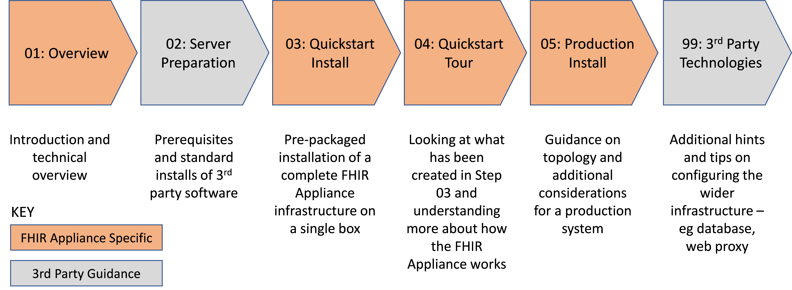
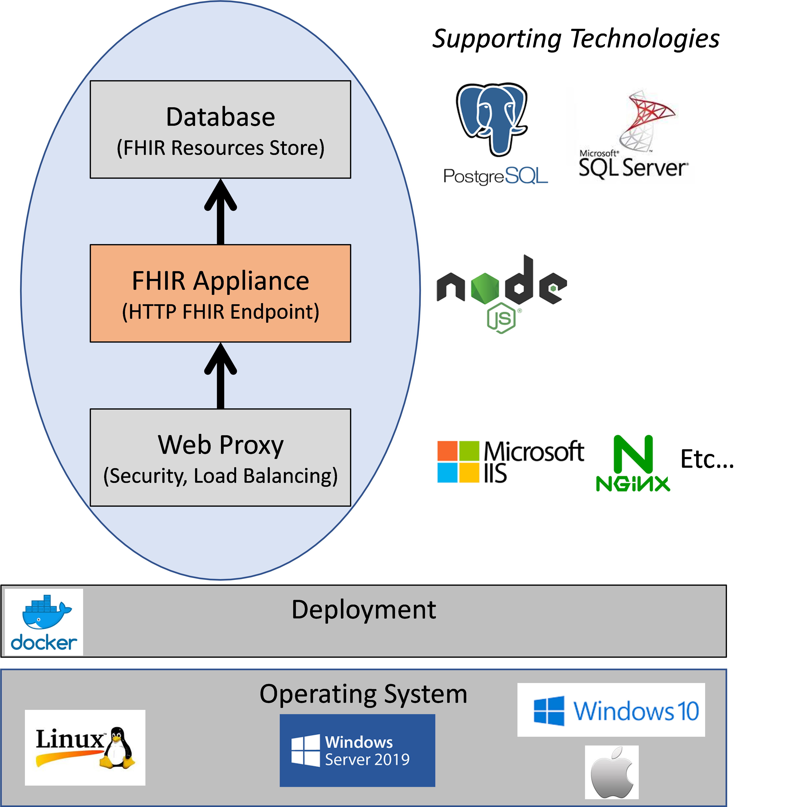

FHIR Appliance Installation

01 - Overview

Version 2 – May 2021

# Table of Contents

[1 Introduction 4](#introduction)

[1.1 Purpose of this Document 4](#purpose-of-this-document)

[1.2 Intended Audience 4](#intended-audience)

[1.3 Document Map 5](#document-map)

[2 Technical Overview 6](#technical-overview)

[2.1 FHIR Appliance 6](#fhir-appliance)

[2.2 Database (FHIR Store) 6](#database-fhir-store)

[2.3 Web Proxy 7](#web-proxy)

[2.4 Docker 7](#docker)

[2.5 Operating Systems 8](#operating-systems)

[3 Assumed Skillsets 9](#assumed-skillsets)

**  
**

**Version Control**

| **Version** | **Release Date** | **Released By** | **Reason for Release** |
|-------------|------------------|-----------------|------------------------|
| 1           | 16/02/2021       | Tim Davey       | Preliminary Draft      |
| 2           | 18/05/2021       | Tim Davey       | Revised and updated    |

**Reviewers**

| **Initials** | **Name** | **Role** | **Organisation** |
|--------------|----------|----------|------------------|
|              |          |          |                  |
|              |          |          |                  |
|              |          |          |                  |
|              |          |          |                  |
|              |          |          |                  |
|              |          |          |                  |
|              |          |          |                  |
|              |          |          |                  |
|              |          |          |                  |
|              |          |          |                  |
|              |          |          |                  |
|              |          |          |                  |
|              |          |          |                  |
|              |          |          |                  |
|              |          |          |                  |
|              |          |          |                  |
|              |          |          |                  |
|              |          |          |                  |
|              |          |          |                  |
|              |          |          |                  |
|              |          |          |                  |
|              |          |          |                  |

# Introduction

## Purpose of this Document

This is the first in a series of papers which provide guidance to
partner organisations who wish to install and configure the standard,
centrally-provided, FHIR Appliance.

These papers cover an overview of the architecture, practical deployment
considerations and also detailed technical install instructions.
Evidently the main focus is on the centrally-provided components,
however the papers do also provide some guidance on related
technologies, to assist with implementing a successful end-to-end
solution.

## Intended Audience

***The main audience is technical staff at a Data Provider who will be
involved in the installation and configuration of a FHIR Appliance***.

Other potential audiences include:

-   **Technical managers and architects** – who wish to gain an overview
    of how the FHIR Appliance works and the what is involved in
    installing it

-   **Data Consumers** – a Data Consumer organisation may wish to gain a
    deeper insight into exactly how the Data Providers they are
    connecting to work. It would also be possible for a Data Consumer to
    follow these instructions and set up their own “stub” Data Provider
    for internal testing purposes

-   **Technical Support Staff and Testers** – to gain an understanding
    of how the FHIR Appliance works and thus better diagnose any issues

***Note that this document set focuses on the non-Intersystems FHIR
Appliance (often known as the “Docker” or “Node” FHIR Appliance).***

There is also an Intersystems option with equivalent functionality, and
separate documentation provides detailed installation instructions for
this. There is however much general information provided in these
documents about the workings of the integration connectivity, and
Intersystems users should still find a skim-read of this documentation
set useful.

## Document Map

This document is the first in a set which walks through the entire
process of installing the FHIR Appliance and connecting to the messaging
exchange. As indicated above, some of these steps are specific to the
FHIR Appliance itself, whilst others provide guidance on the use of
supporting 3rd party technologies. Each step builds upon the
ones before, and it is recommended to work through the process in
sequence

# Technical Overview 

The diagram provides a very high-level conceptual overview of the FHIR
Appliance architecture and the technologies involved. Key points to
appreciate are as follows:

## FHIR Appliance

The FHIR Appliance is the core software provided to assist with
connecting to the messaging exchange. It implements a FHIR server – ie a
HTTP listener endpoint which can process RESTful FHIR messages. This
server is conformant with FHIR open standards and fully implements all
of the messaging patterns, audit, and other requirements. It is
specifically designed and tested to interoperate seamlessly with the
messaging exchange central infrastructure.

The FHIR Appliance is written in Node.js. However in most cases this
will be an internal implementation detail – as it is provided wrapped as
a Docker container for ease of deployment.

## Database (FHIR Store)

The FHIR Appliance persists information in a database. This persistence
requirement is relatively basic and consists of two simple schemas which
allow for:

-   ***Persistence of FHIR Resources*** – FHIR Resources are formatted
    > into JSON strings and loaded in the database ready to be served. A
    > single table handles all FHIR Resource types.

-   ***Audit*** – The FHIR Appliance persists comprehensive audit
    > records - in full compliance with audit requirements

There are currently two supported database options:

-   ***Postgres*** - a widely accepted industry-standard open source
    database.

-   ***Microsoft SQL Server*** (2016 upwards) – a common choice of
    database for Microsoft / Windows sites.

It envisaged that the most common combinations will be Postgres with
Linux, and MSSQL with Windows. However the FHIR Appliance itself is
entirely database agnostic and other combinations are possible.

## Web Proxy

The messaging exchange is a secure system, and so it is anticipated that
the FHIR server will be protected behind a hardened web proxy. This
proxy serves several purposes including:

-   ***Network Isolation*** – providing a layer of network isolation
    > between the FHIR endpoint itself and external networks

-   ***SSL and Certificate Management*** – managing keys and
    > certificates and implementing TLS Mutual Authentication for
    > connections to the central infrastructure. These certificates are
    > issued as part of the Onboarding Process.

-   ***Load Balancing*** – proving load balancing for a resilient
    > deployment

There are many Web Proxy technologies available and we do not prescribe
any specific one – it is assumed that your organisation will already
have its own infrastructure standards and preferences. Popular web
proxies, as of this writing, are IIS (on Windows) and NGINX (on Linux)
and so some tips will be provided for these where relevant.

Note: If the only requirement is for SSL then the FHIR Appliance does
provide an in-built option to configure SSL on its endpoints[1]. This
may be useful for:

1.  ***A quick, simple, self-contained test system setup***. However for
    production use it is anticipated that the need for network isolation
    and load balancing will necessitate the use of a separate Web Proxy
    server.

2.  ***To provide additional network security on internal links between
    servers***. For example using self-signed certificates to encrypt
    internal network traffic between servers. This use is probably rarer
    but, depending on internal network topology, may be required by some
    organisational security policies.

## Docker

Docker is used as a deployment technology, and is a widely accepted
industry standard for this purpose.

-   The core FHIR Appliance (Node.js) component is provided as a Docker
    > container. This makes it highly portable for deployment purposes.

-   A more elaborate Docker deployment of a complete test infrastructure
    > is also provided as a “quickstart” install. This is optional, but
    > allows an environment to be got up-and-running very quickly for
    > initial development and prototyping purposes.

## Operating Systems

The following operating systems are supported:

-   **Linux** – the central messaging exchange systems run on Linux and
    > this is the original, native, environment of the FHIR Appliance.

> ***If deployment to Linux (Ubuntu 18.04) is an option, then it is
> recommended as the preferred choice.***

-   **Windows Server 2019** – the core FHIR Appliance can be deployed as
    > a container on Windows Server. Specialist “windows” docker
    > containers are required for Windows Server, and appropriate
    > deployments of the core FHIR Appliance are provided for Windows
    > Server 2019.

-   **Docker Desktop (Windows 10, Mac, Linux)** – this is another option
    > for non-production deployments. Docker Desktop runs Linux
    > Containers.

> *<u>Note on Windows 10</u> – On Windows 10 then Microsoft now provide
> the Windows Subsystem on Linux v2 (WSL2). This offers full Linux
> support, and therefore Windows 10 can now run native Linux containers.
> Evidently this is a desktop operating system however, and not suitable
> for production deployments*

The table below summarises this discussion.

# Assumed Skillsets

As outlined in the previous section, the FHIR Appliance itself fits into
a wider technical environment. Certain skills and knowledge are assumed
as a prerequisite to a successful deployment:

Excellent resources and tutorials on all of these technologies can be
found online, and some preparatory research on any unfamiliar topics is
highly recommended.

[1] Previous versions of the FHIR Appliance used a 3rd party
component – the Traefik proxy – to provide SSL. This is no longer needed
as SSL is now built in to the FHIR Appliance itself. Traefik remains
available as a 3rd party Web Proxy server (alongside other
options such as IIS and NGINX) and remains a possible choice for
organisations which prefer it, or who are already using it. However it
is no longer bundled with this installation.
