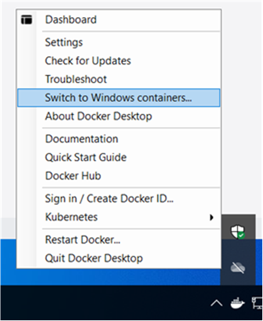
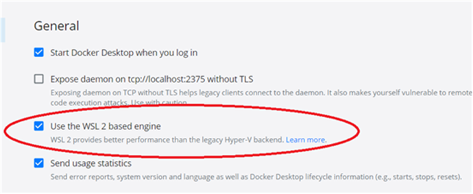
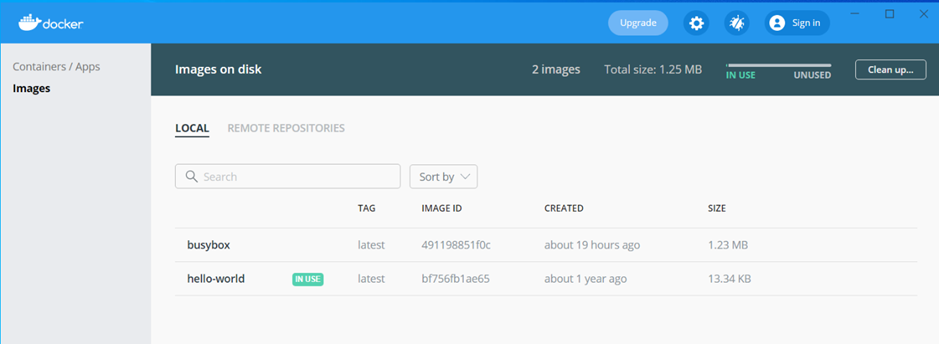

# FHIR Appliance Installation

# 02 – Server Preparation

**Table of Contents**

[1 Introduction](#introduction)

[1.1 Purpose of this Document](#purpose-of-this-document)

[2 General Server Prerequisites](#general-server-prerequisites)

[3 Installing Docker](#installing-docker)

[3.1 Linux Server](#linux-server)

[3.2 Windows Server](#windows-server)

[3.3 Docker Desktop on Windows 10](#docker-desktop-on-windows-10)

[3.4 Docker Desktop on Mac and Linux](#docker-desktop-on-mac-and-linux)

[4 Other Tools and Configuration](#other-tools-and-configuration)

[4.1 Text Editor](#text-editor)

[4.2 Browser](#browser)

[4.3 OpenSSL](#openssl)

[4.4 Other Optional / Developer Tools](#other-optional-developer-tools)

[5 Appendix A - Docker Primer](#appendix-a---docker-primer)

# Introduction

## Purpose of this Document

This document is part of a set which walks through the entire process of
installing the FHIR Appliance and connecting to the messaging exchange.
It is assumed that the preceding document(s) have already been read, and
material already covered will not be repeated.

This document specifically focuses on preparing a server prior to
beginning installation of the FHIR Appliance components per-se. It
covers:

1.  General server prerequisites

2.  Installing Docker

3.  Other tools and configuration

***Note that this paper is entirely concerned with industry-standard
technologies which are not directly provided as part of this
installation.***

***Considerable research has been put into preparing the notes and they
have been carefully tested – the aim is to help get your installation
working as quickly and easily as possible.***

***However ultimately the central team cannot be responsible for
configuration of these 3rd party technologies, and you may
need to supplement these notes with your own expertise and with
knowledge of your own specific environment and organisational
standards.***

# General Server Prerequisites 

You will require:

1.  **A server running one of the supported operating systems**

This server could be either physical or virtual, on-premise or in the
cloud. The supported operating systems are:

-   **Linux** – the installation has been tested against Ubuntu 18.04
    LTS (Bionic Beaver or Bionic)

-   **Windows Server 2019**

Or, for a non-production developer installation, a desktop running one
of:

-   **Windows 10**

-   **Mac**

-   **Linux**

> See the first paper in this series for further discussion on the
> pros-and-cons of each operating system option. If Linux is an option
> in your organisation, then it is recommended as the preferred choice.

2.  **Admin rights on the server**

You will be installing software and making configuration changes which
require full admin rights

3.  **Internet access**

It will be necessary to “see” the internet in order to pull down
installation packages and updates

4.  **A “clean”, “vanilla” server (highly recommended)**

Complications can occur when a server either (a) contains other
existing software or debris from previous installations or (b) is
locked-down with corporate policies and security settings.

This is not to say that these things cannot coexist, however they may
interfere and make the task more difficult. Experience suggests that
it is best to gain experience with a working “clean” installation
first, and then proceed to add these other factors in a systematic
way. In the case of security policies, it is recommended to achieve a
working server and then to add security configuration back in
incrementally, testing at each step to ensure no detrimental effect.

An example of a potential issue is antivirus, and anti-virus problems may become evident when Docker tries to extract images after it has finished downloading. Users will see the Docker process hang and, in some cases, CPU spikes. Further guidance is available from docker at https://docs.docker.com/engine/security/antivirus/ 

# Installing Docker

If Docker is new to you then it is recommended to arm yourself with a
foundational understanding before proceeding. See Appendix A which
provides a brief primer, and there are many other good resources and
tutorials available online.

Details of the installation vary by operating system:

## Linux Server

Full instructions are available here:
<https://www.digitalocean.com/community/tutorials/how-to-install-and-use-docker-on-ubuntu-18-04>

In summary the process involves connecting to the relevant repository
and pulling down the Docker packages. The author’s experience is that
this is a very quick and reliable process. The steps are:

1.  Update existing packages: ***sudo apt update***

2.  Install pre-requisite packages: ***sudo apt install
    apt-transport-https ca-certificates curl
    software-properties-common***

3.  Add the GPG key for the official Docker repository: ***curl -fsSL
    https://download.docker.com/linux/ubuntu/gpg \| sudo apt-key
    add -***

4.  Add the Docker repo to apt sources: ***sudo add-apt-repository "deb
    \[arch=amd64\] https://download.docker.com/linux/ubuntu bionic
    stable"***

5.  Update the package database with Docker packages: ***sudo apt
    update***

6.  Install Docker: ***sudo apt install docker-ce***

In addition, you will need to install Docker-Compose:

1.  At the command line: ***sudo apt install docker-compose***

And finally, test your installation:

1.  Check that basic commands are working eg:

    -   ***docker version***

    -   ***docker-compose version***

2.  Verify that the docker daemon is started:

    -   ***sudo systemctl status docker***

3.  Run a simple demo

    -   ***docker run hello-world***

## Windows Server

In summary the installation process again involves connecting to a
repository and pulling down the Docker packages. The author’s experience
is that this also a fairly straightforward process.

It is however important to understand that you are installing Docker
Enterprise Edition for “Windows Containers”. This requires Docker images
that have been specially prepared for the correct Windows operating
system. These Windows Container images are provided as part of the
installation for the FHIR Appliance itself. Availability of Windows
Container images from other 3rd parties varies. (For example
as of this writing there is not a Windows Container version of Postgres
available).

Note that a full implementation of native Linux containers is promised
by Microsoft for Windows Server 2019. This is currently in preview, for
example see
<https://bcthomas.com/2019/02/getting-started-with-linux-containers-on-windows-server-2019/>
The author’s (frustrating!) experience is that as of this writing in
February 2021 it does not work properly. However it is certainly an area
worth watching in future – as it would remove the above dependency on
specially prepared Windows Containers.

Full instructions for the Docker Enterprise Edition install on Windows
Server are available here:
<https://docs.microsoft.com/en-us/virtualization/windowscontainers/quick-start/set-up-environment?tabs=Windows-Server>
The steps are:

1.  Open PowerShell in elevated/administrator mode

2.  Update the TLS version so that the server can access the
    PSRepository: ***\[Net.ServicePointManager\]::SecurityProtocol =
    \[Net.SecurityProtocolType\]::Tls12***

3.  Install the docker PowerShell module. This automates various aspects
    of the install, including enabling necessary server features:
    ***Install-Module -Name DockerMsftProvider -Repository PSGallery***

4.  Install the docker package: ***Install-Package -Name docker
    -ProviderName DockerMsftProvider***

> *Note that these commands will raise a number of prompts, and you will
> need to select “Y”es or “A”ccept All to continue*

5.  ***Restart the server***

You will also need to install Docker Compose:

1.  In PowerShell run: ***Invoke-WebRequest
    "https://github.com/docker/compose/releases/download/1.28.2/docker-compose-Windows-x86_64.exe"
    -UseBasicParsing -OutFile
    $Env:ProgramFiles\\Docker\\docker-compose.exe***

And finally, test your installation:

1.  Check that basic commands are working eg:

    -   ***docker version***

    -   ***docker-compose version***

2.  Verify that the docker Service is started, and is set to autostart
    (eg by viewing Services from Control Panel)

3.  Run a simple demo

    -   ***docker run hello-world***

One final point worth noting for Windows Server is that docker
containers do not seem to autostart on reboot (even if they are
seemingly configured to do so). A start-up script to run the necessary
docker-compose commands is therefore needed. This will be covered again
in later documents along with details of the specific FHIR Appliance
start-up scripts – however it is a general point about docker on Windows
Server that is worth being aware of.

## Docker Desktop on Windows 10

The installation process on Windows 10 is more fiddly but the end-result
is very satisfactory – with a fully functional Linux-compatible docker
implementation. There are however some vital pre-requisites to be aware
of:

-   **Pre-requisite 1 – Nested Virtualisation Support**

> Windows 10 provides full Linux support by running a Linux VM within
> Windows 10. However if your Windows 10 box itself is virtualised then
> this means you will be running “nested” virtual machines. Searching
> online will reveal various information and instructions about how to
> enable this – none of it entirely reliable. The fact seems to be that
> it can depend on many factors including the exact hardware you are
> using.

-   In the cloud then it is important to choose a VM specification that
    supports nested virtualisation

-   On a physical machine then it may controlled by a BIOS setting

> Some investigation may therefore be needed. The author struggled for
> some time with mysterious error messages which were eventually traced
> back to this pre-requisite, so it is important to bear in mind if you
> are running Windows 10 on a VM and have similar problems.

-   **Pre-requisite 2 – Windows Subsystem for Linux v2 (WSL2)**

> Microsoft have entirely revamped the Linux emulation on Windows 10.
> Previously WSL(1) provided bash-shell emulation, whilst docker used a
> separate Hyper V virtualisation mechanism. WSL2 is a significant step
> forwards and replaces both of these older technologies with a single
> Linux emulation technology. It provides a full Linux docker experience
> on Windows 10, and it is essential to upgrade to WSL2 to get this
> working properly.
>
> Full instructions can be found here:
> <https://docs.microsoft.com/en-us/windows/wsl/install-win10>

1.  Enable the Windows Subsystem for Linux: ***dism.exe /online
    /enable-feature /featurename:Microsoft-Windows-Subsystem-Linux
    /all /norestart***

2.  Enable the Virtual Machine Platform ***dism.exe /online
    /enable-feature /featurename:VirtualMachinePlatform /all
    /norestart***

3.  Restart

4.  Download the Linux kernel update package from:
    <https://wslstorestorage.blob.core.windows.net/wslblob/wsl_update_x64.msi>

5.  Set WSL 2 as your default version: ***wsl --set-default-version 2***

> There is an additional final step in the online instructions which
> covers installing a Linux shell from the Windows Store. This is
> optional, but extremely cool! It is also a good way to test your
> installation – you should find that you can open a fully featured
> Linux shell on your Windows 10 desktop.

-   **You are now ready to install Docker Desktop,**

The installation package can be downloaded from here:
<https://www.docker.com/products/docker-desktop>

This is a complete installation which includes Docker Compose and also
Docker Dashboard. The latter is a GUI presentation of Docker which is
a useful way to become more familiar with the concepts if Docker is
new to you.
>
Once the installation is complete there are some points to check.
Right click on the docker system tray icon:

-   ***Check that you are running Linux Containers***

You can confirm this if it offers the option to “Switch to Windows
containers…” -which implies you are currently running Linux
containers. This is what we want. **DO NOT select the option to switch
to Windows containers!!** (Or if you do… make sure to switch back to
Linux again)

-   ***Make sure you are running WSL2 (not the older Hyper V
    mechanism)***

From the context menu, choose Settings, and check that the WSL2 option
is selected

Finally test your installation:

1.  ***docker run hello-world***

If you are new to Docker then it is also worth spending some time
exploring in the Docker Dashboard application – which provides a helpful
visual way to grasp docker’s concepts and capabilities

## Docker Desktop on Mac and Linux

The installation package can be downloaded from here:
<https://www.docker.com/products/docker-desktop>

Further instructions could be provided on request, however this
installation should be straightforward. (Additional notes have been
provided for Windows 10 due to the additional complexities of
configuring the correct Windows Subsystem for Linux prerequisites).

# Other Tools and Configuration

There are some other basic tools which you will need:

## Text Editor

This will be used to edit configuration files. No doubt you already have
your preferences:

-   On Windows it might be Notepad, or Notepad++
    (<https://notepad-plus-plus.org/> )

-   On Linux it might be vi or nano (***sudo apt install nano***)

## Browser 

This will be used to view technical websites and download installations
– as well as to access admin consoles (eg database manager) and to test
the installation. Again you probably already have your preferences – if
unsure then Chrome is a good choice:

<https://support.google.com/chrome/answer/95346?co=GENIE.Platform%3DDesktop&hl=en-GB>

(Note: The very old version of Internet Explorer that comes as default
with Windows Server is unlikely to be adequate. More recent versions of
Edge should be OK.)

If you are working on a terminal-based Linux server then you may have to
use a browser hosted elsewhere. This should not be a problem – obviously
remember to open any necessary firewalls and to substitute any
references to “localhost” with the relevant IP address.

## OpenSSL

This will be needed to create certificates and key-pairs.

-   On Linux it is an intrinsic part of the operating system – nothing
    extra to do

-   On Windows it can be surprisingly difficult to get hold of:

    -   OpenSSL is an open source project, see
        <https://www.openssl.org/> In theory it is possible to
        download the code and build it yourself, although this is not
        an especially practical option for most.

    -   The OpenSSL community maintain a list of pre-built binary
        distributions, see
        <https://wiki.openssl.org/index.php/Binaries> The author has
        downloaded the first of these from “Shining Light Productions”
        <https://slproweb.com/products/Win32OpenSSL.html> and it
        certainly worked – although the website is not greatly
        confidence inspiring and the risks of trusting this download
        in a production environment would need to be carefully
        assessed.

    -   Git comes with a built-in bash shell which includes OpenSSL. The
        implementation is a little quirky and some extra escaping of
        characters (eg “//”) may be needed – search online if you
        encounter unexpected errors

    -   Use Linux! This could be a separate Linux VM, or via the
        bash-shell within Windows

## Other Optional / Developer Tools

These are not required, but may be relevant if you are setting up a
local development environment to work with the FHIR Appliance:

-   **Git**

> A git repository is offered as an option for downloading the
> installation materials and code. You can install git here:
> <https://www.git-scm.com/>

-   **Node.js**

> Node isn't required to run the FHIR Appliance, however, the repo comes
> with npm scripts which provide another option to run the software from
> a single command line call.

-   **Development Environment/Editor**

> The flavour of dev environment is of course entirely up to you. VS
> Code, Atom and Sublime are extensible, open source and free. Each
> environment does have decent Docker integration which can be installed
> via the usual plugin/extension management features.

***Congratulations! The sever is prepared - and you are now ready to
move on and install the FHIR Appliance itself.***

# Appendix A - Docker Primer

If you are unfamiliar with Docker then it is highly recommended to
gain a basic understanding before proceeding. There are many good
resources and tutorials which you can easily find online, and so this
Appendix is intentionally extremely brief.

**Docker** is a deployment and virtualisation technology. Its core
concept is “**containers**”, which are an evolution of virtual
machines. Docker solves the problem of having to download, store and
maintain many large VM images. Instead docker is lightweight - and the
**images** are very quick to download and get running. It achieves
this by building images in “**layers**”, thus allowing base layers (eg
the operating system code) to be reused across images.

Docker originated on Linux, where it soon became a widely used
de-facto standard. Microsoft quickly recognised its importance and has
worked hard to port the technology to Windows. It has rapidly matured
on Windows also – although Microsoft still has a future roadmap of
development to achieve full parity with Linux.

**Docker Compose** is an extension of Docker, which allows you to
provide a single configuration file which defines a whole
infrastructure - ie multiple virtual “servers” (containers),
networking, storage, etc. It is a very powerful way to spin up an
entire infrastructure within a single host using a single command –
and to remove it again just as easily.

Useful docker commands include:

-   ***docker ps*** - to show what is running and get container IDs and
    Docker statistics (The same idea as ps on Linux, and similar to
    Windows Task Manager)

-   ***docker logs \<name>*** - to see the logs for a container. Add -f
    (for follow) to go into interactive log mode

-   ***docker inspect \<name>*** - lots of other info about the
    container

-   ***docker images*** (or ***docker image ls***) – see the list of
    downloaded images

-   ***docker image inspect \<id>*** (eg docker image inspect
    2694e98c9711) - gets lots of info about the image, for example
    dates, size, version, etc

-   ***docker-compose up*** – run up an entire infrastructure as defined
    in the default file called docker-compose.yml

-   ***docker-compose up -d*** – as above, but in “detached” mode – ie
    run it in the background and release the console

-   ***docker-compose down*** – spin down the infrastructure as defined
    in the default docker-compose.yml

-   ***docker-compose -f filename.yml up*** – run up an entire
    infrastructure as defined in the specified filename.yml

-   ***docker-compose -f filename.yml down*** – spin down the
    infrastructure as defined in the specified filename.yml
