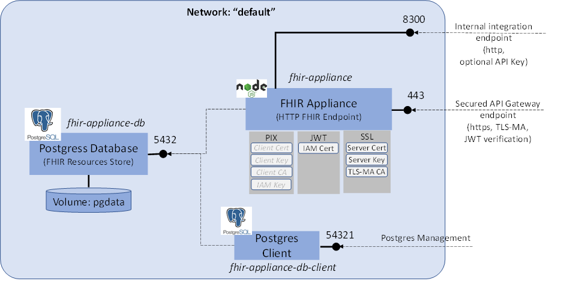
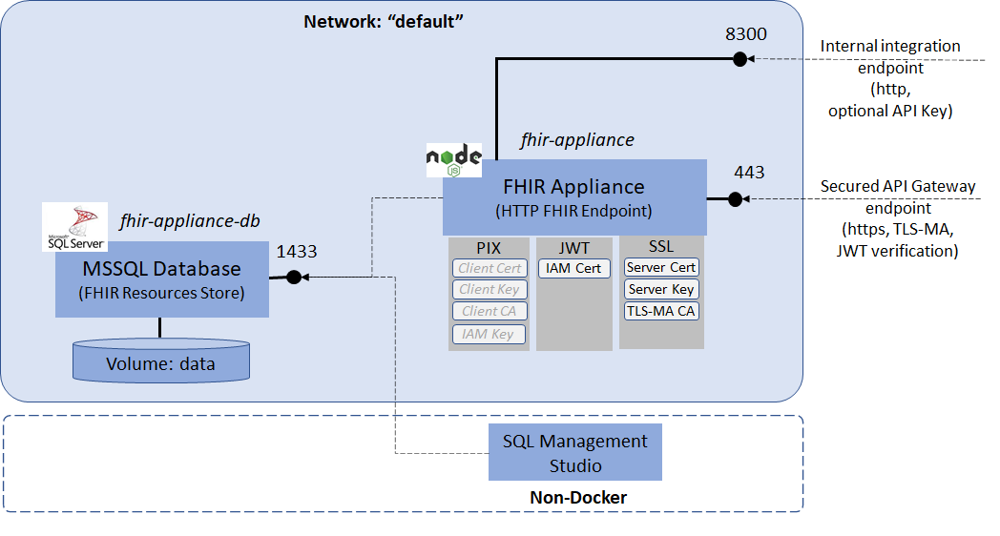
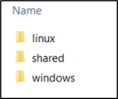
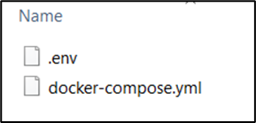
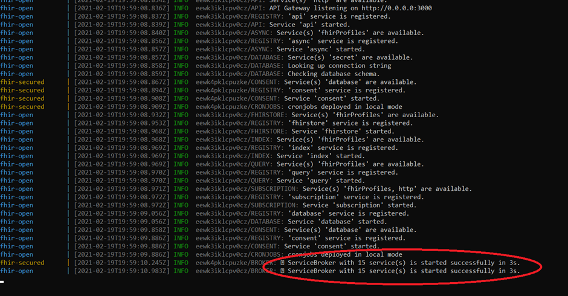
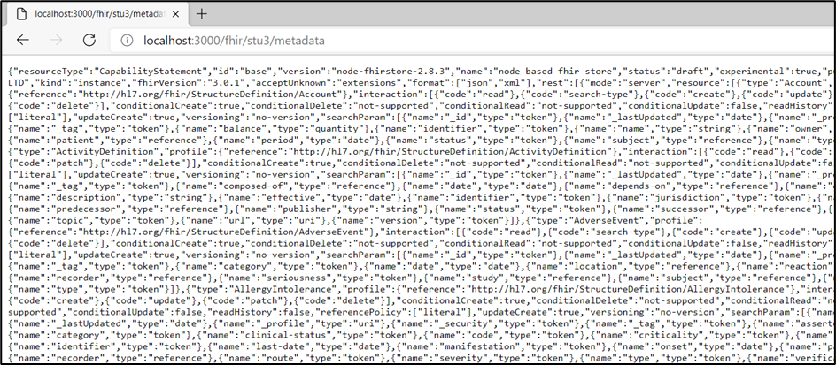
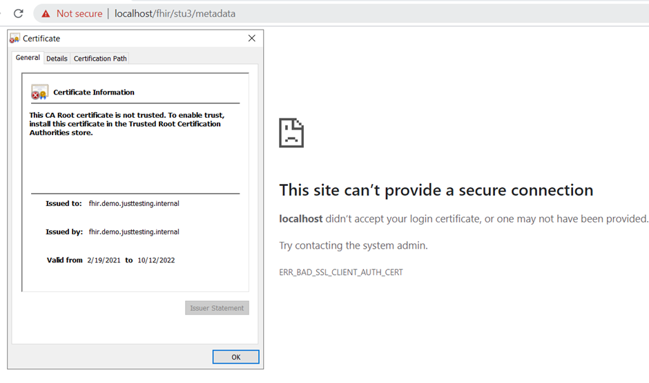
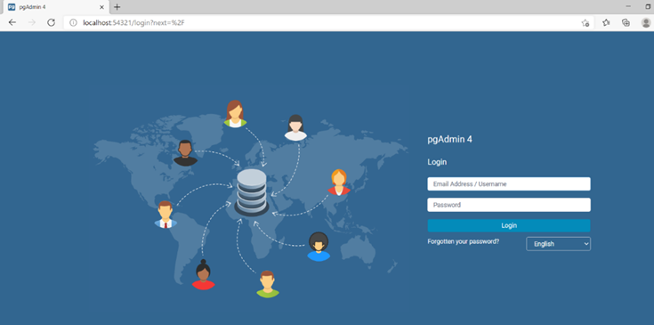

# FHIR Appliance Installation

# 03 – Quickstart Install

**Table of Contents**

[1 Introduction](#introduction)

[1.1 Purpose of this Document](#purpose-of-this-document)

[2 Super Quick Start](#super-quick-start)

[3 The Quickstart Design](#the-quickstart-design)

[3.1 Overview](#overview)

[3.2 Database (Postgres or MSSQL)](#database-postgres-or-mssql)

[3.3 FHIR Appliance](#fhir-appliance)

[3.4 Keys and Certificates](#keys-and-certificates)

[4 Configuration Files](#configuration-files)

[4.1 Download Configuration](#download-configuration)

[4.2 Tour of the Configuration](#tour-of-the-configuration)

[4.2.1 Docker Compose Configuration](#docker-compose-configuration)

[4.2.2 FHIR Appliance Configuration](#fhir-appliance-configuration)

[4.2.3 Example Certificates and Keys](#example-certificates-and-keys)

[5 Quickstart Installation](#quickstart-installation)

[6 Smoke Test](#smoke-test)

[7 Appendix A – Generating a Self-Signed Certificate](#appendix-a-generating-a-self-signed-certificate)

# Introduction

## Purpose of this Document

This document is part of a set which walks through the entire process of
installing the FHIR Appliance and connecting to the messaging exchange.
It is assumed that the preceding document(s) have already been read, and
material already covered will not be repeated.

This document covers setting up a “Quickstart” installation – in other
words a full working prototype environment on a single box. This could
be used as a developer / demo environment, or as a rehearsal prior to
the main install. Important points to note are:

-   ***It is assumed that you have already worked through paper “02 –
    Server Preparation” to install prerequisites on the server***

-   ***It is assumed that you will go on to study the remaining papers
    before deploying to production – ie the steps in this paper do not
    lead to a production-ready deployment.***

-   ***There are two options for the “quickstart” install:***

1.  ***Linux Containers, with Postgres – ie on Linux or with Docker
    Desktop (Windows 10 or Mac).***

2.  ***Windows Containers, with MSSQL – ie on Windows Server 2019***

    -   The quickstart also bundles a containerised
        database along with the FHIR Appliance, all on the
        same box. Note that this is not a best-practice for
        production, but enables a quick and easy demo deployment.

    -   The quickstart is pre-configured with the most common
        server/database pairings (Linux-Postgress and Windows-MSSQL), but note that other combinations are
        possible if desired for your own deployments

The good news is that, having completed the Server Preparation steps,
then docker makes the actual install very quick and easy. Most of this
document therefore focuses on explaining <u>what</u> is being installed
and how it works and is configured. The actual installation is at the
end and is brief.

# Super Quick Start

If you are already knowledgeable about the technologies involved and are
impatient to get going then the basic steps are:

1.  Make sure you have Docker installed

2.  Pull down the repo

3.  Navigate to either the ***quickstart/linux*** or
    ***quickstart/windows*** directory

4.  Run ***docker-compose up***

5.  Browse to ***<http://localhost:8300/fhir/stu3/metadata>*** to view
    the Capability Statement from your new FHIR Server!

6.  Review the configuration files to understand more about the options
    available

The rest of this paper walks through the process in more detail, with
additional explanation and elaboration of the components involved

# The Quickstart Design

## Overview

The Quickstart solution is provided as a Docker Compose file. This spins
up the entire infrastructure with a single command. However before
looking at the technical configuration, this section explains the design
we are trying to build. The diagram below provides an overview – the two
variants are essentially the same except for the choice of database:

**<u>Linux Quickstart</u>**

**<u>Windows Quickstart</u>**

## Database (Postgres or MSSQL)

**On Linux:**

A containerised installation of Postgres is bundled as an open source
database. See <https://www.postgresql.org/>. It is used to store FHIR
Resources and the Audit trail.

-   The database listens on port 5432.

-   The pgadmin client is also included as a database administration
    tool. See <https://www.pgadmin.org/>. It is exposed on port 54321.

**On Windows Server:**

A containerised installation of SQl Server Express is bundled

-   The database listens on port 1433.

-   A client administration tool is NOT bundled, so if you do not already have it you will need to separately install a tool such as SQL Server Management Studio

## FHIR Appliance

This is the core software provided to assist with connecting to the
messaging exchange . In this quickstart configuration then <u>two</u>
endpoints are configured:

-   One endpoint is for “internal” integration use and is exposed via
    http on port 8300. This means you can simply call it with no
    security hurdles to overcome – thus providing instant
    gratification for a demo! In a more realistic environment this
    approach could still be relevant for your own internal services to
    connect to. For example, your own internal integration engine
    loading FHIR Resources. There is the option to add an API Key to
    provide additional internal security if desired.

-   The other endpoint is the “external” API Gateway and is secured and
    available only via https on port 443:

    -   It has transport security configured - specifically SSL and TLS
        Mutual Authentication.

    -   It has JWT message signature validation configured - to apply
        security checking to the message content.

## Keys and Certificates

The quickstart comes configured with a set of self-signed keys. As such
they are not intended to be secure, and they will not work with the
central messaging exchange. However they do work for an initial local
demo and can help to demonstrate the concepts and configuration. These
keys and certificates may be considered in three groups:

-   **SSL**

    -   A ***server key and certificate pair*** to establish SSL
        connectivity (https)

    -   The ***public root certificate*** used to provide TLS Mutual
        Authentication of incoming connections. (Approved clients such
        as the messaging exchange hold a matching private key which
        they use to prove their identity)

-   **JWT**

    -   The public IAM certificate used to verify incoming messages.
        (Approved clients such as the messaging exchange hold a
        matching private key which they use to sign the message tokens
        used in their requests).

-   **PIX**

> PIX is the Patient Identifier X-ref – it is the component of the
> central messaging exchange where Data Providers must register the NHS
> Numbers of patients about whom they hold information. The FHIR
> Appliance offers the ability to automate this process by triggering
> central PIX registration whenever a Patient Resource is loaded to the
> local repository. Additional credentials are needed for this,
> including

-   ***SSL client certificate, key, and public Root certificate*** – to
    establish identity at a transport level when connecting to the
    central servers

-   ***IAM signing key*** – to further prove identity by signing
    messages when requesting access tokens from IAM

> Note that these PIX credentials are NOT included in the quickstart -
> as it is not meaningful to demo with self-signed examples. Proper
> certificates will need to be obtained as part of the Onboarding
> process, and so this will be returned to later when we look at the
> additional considerations for production and onboarding.

# Configuration Files

## Download Configuration

***Copy the configuration files onto your chosen server.***

-   Open in a browser to
    <https://github.com/yorkshire-and-humber-care-record/fhir-appliance>,
    look for the green “Code” button, select “Download ZIP”, and unzip
    the files

The location of the install on the server is your choice

Once you have a copy of the files downloaded then look inside the
“quickstart” folder

***The first thing to notice is that the installation is very small and
consists of only a few text-based configuration files. Docker will
automatically download the latest version of the actual container images
the first time it is run.***

## Tour of the Configuration

It is worth taking some time to examine each configuration file to
understand what it does. (There is a separate folder for Linux and
Windows, although with very similar contents)

***It is strongly recommended to take some time and understand the
configuration.***

***However everything is configured with defaults and ready-to-go – so
it is possible to proceed directly to the next section and run up the
system if you wish!***

### Docker Compose Configuration

-   ***docker-compose.yml*** – this is the main Docker Compose
    configuration file which describes the whole environment. ***Please
    take some time to study this file, and make sure you understand each
    section and what it does***. Even without a deep knowledge of Docker
    Compose it should be fairly easy to match up the configuration in
    the file with the diagram in section 2.1. If necessary refer to the
    Docker Compose documentation at
    <https://docs.docker.com/compose/compose-file/compose-file-v3/> or
    other online tutorials.

A couple of points that may need further explanation:

-   You will see some “***volumes***” entries – these are mostly fairly
    obvious and mount configuration files so that they are visible
    inside the docker environment. A separate volume is also created
    to persist the database files. This ensures that they persist even
    when the docker environment is spun down. (Otherwise the database
    would be wiped. If you actually want to wipe the database then
    ***docker-compose down -v*** destroys all volumes to achieve
    this.).

### FHIR Appliance Configuration

The ***.env*** file is the configuration file for the FHIR Appliance.
The file is well documented with comments, so again ***please take some
time to study this file and understand the various sections***. These
can be summarised as:

-   ***Personalisation Settings*** – these configure several domain
    names and identifiers that need to match your organisation and
    environment. Whilst not vital for a quick initial developer demo,
    they are important to configure correctly before connecting to the
    central message exchange

-   ***Database Connection String*** – this can be either mssql or
    postgres, with standard options to configure user, server, and
    database details

    -   NB1: Referencing the database server by FQDN does not always
        work - IP address is more reliable. (When running inside docker
        for the quickstart then the host name is simply the name of the
        docker container)

    -   NB2: The quickstart for Linux comes with default postgres
        settings pre-configured. ***However it is strongly recommended
        to change the default database password***. Note that a
        corresponding change needs to be made in the docker-compose file
        where the database itself is initialised.

-   ***Endpoints*** – there are many options here, and the quickstart
    comes with some useful defaults configured for an initial demo.
    As-per the “Design Overview” section above these provide two
    endpoints – one fully secured for external use and another open for
    internal use. There are many other options available and it is worth
    reviewing the possibilities. Typical configuration patterns for a
    production deployment are discussed in a later document.

    -   NB: Auditing is an option for each endpoint, and is enabled for
        the quickstart. This meets the requirements of the central
        messaging exchange to maintain a local audit trail of all
        requests

    -   NB: The https endpoint is configured to use the standard port of
        443, but if necessary this can be changed. Be wary of port
        clashes – eg if you already have a web server running on the
        server. (The docker error message in this case may be misleading
        – eg mentioning a “file lock”).

-   ***Authentication*** – message-level authentication is also an
    option for each endpoint.

    -   The external API endpoint is configured with full JWT signature
        verification – this is the most secure option and is required
        for connections to the central messaging exchange

    -   The internal integration endpoint is configured with no message
        authentication – for maximum ease-of-use and a quick demo. Note
        also the option for an API Key – this is an intermediate option
        for internal use, based on a shared secret in the HTTP Headers

-   ***PIX Auto Registration*** – as discussed above, this triggers
    central PIX registration whenever a Patient Resource is loaded to
    the local repository. There is a switch to enable the feature, and
    the rest of the settings relate to credentials needed to connect
    with the central PIX servers.

    -   NB: PIX registration requires proper onboarding to connect with
        the central servers. It is therefore switched off for this
        quickstart demo. We will return to it in a later document when
        considering a more complete / production deployment.
        
-   ***Other Settings*** – there are various other settings, eg relating
        to logging. These may be reviewed, but will usually be left at
        the defaults

### Example Certificates and Keys

The “***shared***” folder contains certificates. As described further in
the “Design Overview” section above these are split into SSL, JWT, and
PIX – as corresponds to the relevant sections of the .env configuration
file.

-   ***These are all self-signed certificates (generated by a “fake” CA)
    for initial demo purposes only***. In a real implementation then
    they will be replaced with certificates generated via the Onboarding
    process

-   The PIX folder is empty – as discussed above, it is not meaningful
    to demonstrate PIX without “proper” certificates and a connection to
    the central messaging exchange

-   There is also a “***central***” sub-folder. This holds the “private”
    keys for TLS-Mutual Auth and IAM Token signing. These would normally
    be held securely in the central messaging exchange and you would not
    have access to them! However for demo purposes then the self-signed
    private keys are provided here. We will use them later to
    demonstrate in practice how the security layers work.

# Quickstart Installation

Check that you have completed the necessary previous steps:

-   Server prepared (see “***FHIR Appliance Install 02 - Server
    Preparation***”)

-   Configuration files downloaded and inspected (see Section 3 above)

Once these preparations are complete then the benefit of docker is that
the actual install itself is very simple:

***NB: On Linux you may need to prefix these commands with sudo***

1.  Ensure your current directory is the relevant “quickstart” directory
    (either linux or windows) where the “docker-compose.yml” file is
    located

2.  Enter the command to spin up the installation: ***docker-compose
    up***

The first time you run this it will take some time, and you will see it
downloading the images. There will also be some delay on startup whilst
the database is initialised. (You may see some errors and the other
components “spinning around” with retries whist they wait for the
database to become available). Subsequent runs will be much faster.

Once successful then you will see logging output similar to the below:

The exact order of events may vary slightly, but near the bottom you
should see a message from the “fhir-appliance” to say that the
ServiceBroker has started successfully.

It is worth taking some time to study these logs and get a feel for what
they are saying. The coloured labels on the left identify activity from
the different components, and it is worth a careful check that there are
no errors highlighted. (Notwithstanding the above notes about a delay
due to database initialisation on the first run). Any other errors
should be investigated before proceeding. One of the more likely errors
is a database connection failure due to passwords mismatch – in which
case check through the configuration files again.

The system is now running in the command window – which is good for
testing as you can easily see the logging output.

3.  When done press ***ctrl-C*** to exit.

Alternatively you can start it up in “detached” mode to run in the
background using: ***docker-compose up -d***

-   You can then check it is running with: ***docker ps***

-   And view the log output with ***docker logs \<name>***

When you have finished then you can spin down the infrastructure and
tidy up with

4.  ***docker-compose down***

# Smoke Test

If all appears to be working then it is good to do a few simple tests to
confirm basic functionality:

1.  Spin up the infrastructure again if necessary: ***docker-compose
    up***

2.  ***In a browser navigate to:***
    ***http://localhost:8300/fhir/stu3/metadata***. (Or alternatively
    ***curl <http://localhost:8300/fhir/stu3/metadata>***)

This is the big test! You should see the server’s metadata statement,
similar to the screenshot below:

***Troubleshooting tip**: one thing to try if it doesn’t work is
replacing “localhost” with the actual server IP address. Historically
there have sometimes been problems with docker resolving local
loopback routing).*

You can also try just ***<http://localhost:8300>*** which should
return basic uptime information This can also be useful for
healthchecks.

3.  ***In a browser navigate to:
    <https://localhost/fhir/stu3/metadata>***.

The previous test was going via the “open” route in. You can also try
the “secured” route – at this stage this is obviously not expected to
work, and you will see the TLS Mutual Authentication rejecting the
connection:

Note that before getting to this screen the browser will warn you that
the https certificate is not trusted. We already know that this is
because it is a self-signed certificate (see also certificate details
in the screenshot above), so it is OK to override this warning. (To
silence the warnings then you could install the self-signed cert into
your computer’s Trusted Root CA store, plus set up “hosts” and/or DNS
routing entries for the FQDN – however this may not be desirable and
is not really necessary).

***Overcoming the security layers protecting this “secured” route in
is something we will tackle as an exercise in its own right later***

4.  ***For Linux quickstart only - In a browser navigate to
    <http://localhost:54321>***

You should see a logon screen for the database client

(***_As previously discussed, you will need to provide your own database
client for Windows / MSSQL_***. For example you may wish to install and/or connect SQL Server Management Studio <https://docs.microsoft.com/en-us/sql/ssms/download-sql-server-management-studio-ssms>)

# If you reach this point, then CONGRATULATIONS – your installation is successful!

However we have so far only done some very simple smoke-tests. In the
next document we will go back for a more detailed tour and to explore
the functionality in more depth.

# Appendix A – Generating a Self-Signed Certificate

This is an optional exercise, if you wish to replace the provided
self-signed SSL certificates with your own.

***NB: The example here describes how to generate a self-signed
certificate-key pair. If you work in a large organisation then there may
well be established procedures for generating SSL certificates to use on
test servers, in which case you should obviously follow these
established practices.***

Otherwise… using OpenSSL issue the command:

***openssl req -x509 -newkey rsa:4096 -sha256 -keyout openssl.key -out
openssl.crt -subj "/CN=yourservernamehere" -days 600 -nodes***

Notes:

-   On Windows you may have to go into a different command shell to do
    this – see “***FHIR Appliance Install 02 - Server Preparation***”
    for details

-   The ***-nodes*** flag means that the key file is not password
    protected. Generally it is a good practice to use passwords, in
    which case remove this flag.

-   This generates a simple self-signed certificate with a CN, but not a
    corresponding Server Alternative Name (SAN). Whilst not essential
    for this exercise, populating a SAN is considered best-practice and
    is checked by modern browsers such as Chrome. For example, see
    <https://stackoverflow.com/questions/43665243/invalid-self-signed-ssl-cert-subject-alternative-name-missing>

To achieve this then change the command to:

***openssl req -x509 -newkey rsa:4096 -sha256 -keyout openssl.key -out
openssl.crt -days 600 -config san.cnf -nodes***
>
And provide a configuration file (in this example called san.cnf)
containing the following text:

> \[req\]
>
> distinguished_name = req_distinguished_name
>
> x509_extensions = v3_req
>
> prompt = no
>
> \[req_distinguished_name\]
>
> CN = yoursevernamehere
>
> \[v3_req\]
>
> keyUsage = critical, digitalSignature, keyAgreement
>
> extendedKeyUsage = serverAuth
>
> subjectAltName = @alt_names
>
> \[alt_names\]
>
> DNS.1 = yoursevernamehere

-   If you are determined to actually silence the browser’s warnings
    about certificate mismatches, then you will need to satisfy the
    browser’s checks that the domain name used in the browser address
    bar matches the CN in the self-signed certificate. You will probably
    need to make routing entries to do this – eg either in the “hosts”
    file on the server where the browser is running or in a local DNS
    server which you control.
