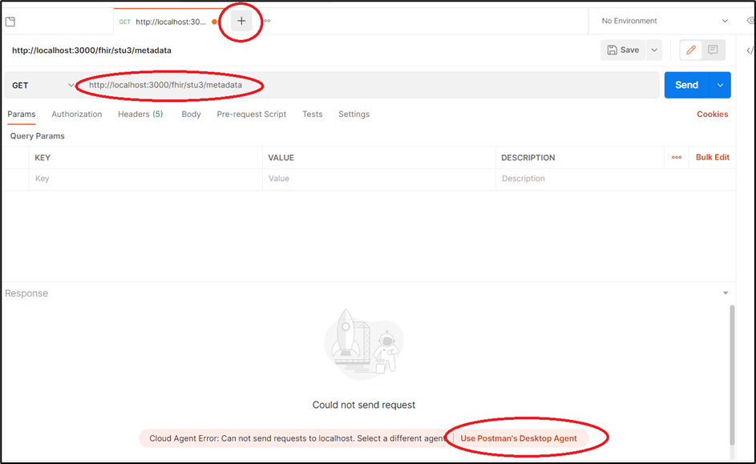
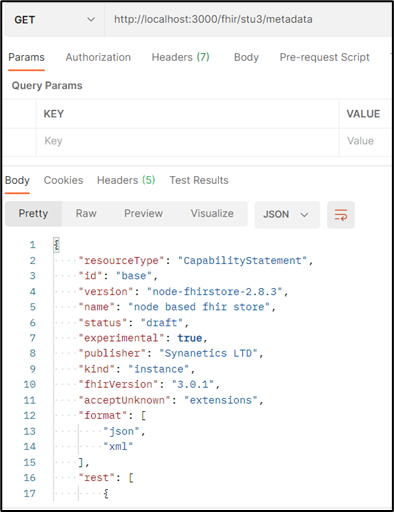
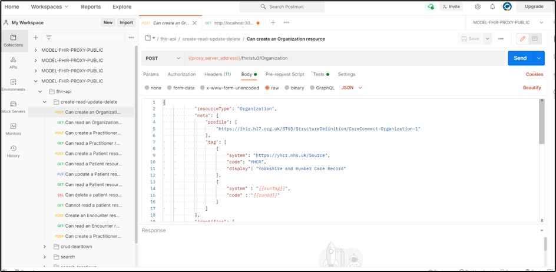
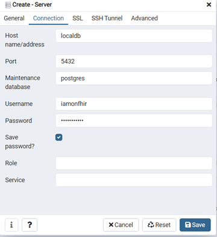
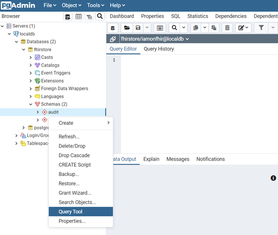
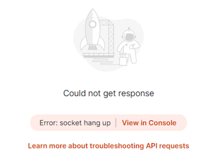
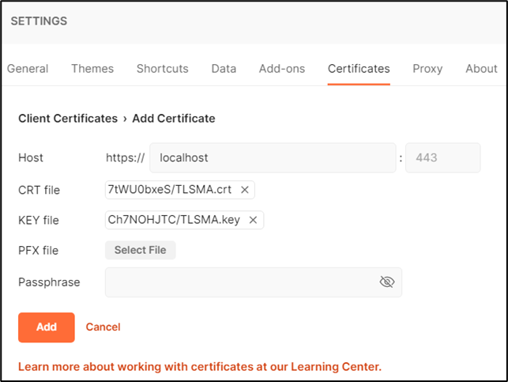
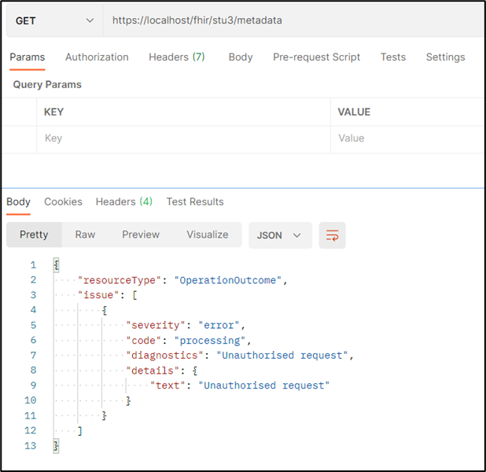
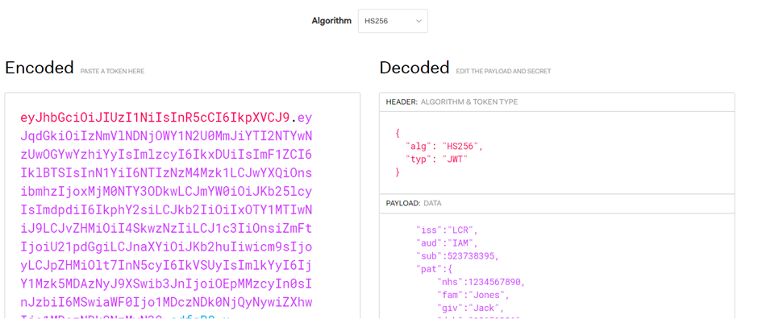

# FHIR Appliance Installation

# 04 – Quickstart Demo

**Table of Contents**

[1 Introduction](#introduction)

[1.1 Purpose of this Document](#purpose-of-this-document)

[2 The RESTful FHIR API](#the-restful-fhir-api)

[2.1 Introduction](#introduction-1)

[2.2 FHIR Background](#fhir-background)

[2.3 Postman](#postman)

[2.4 Demonstration Postman Collection](#demonstration-postman-collection)

[3 The FHIR Store Database](#the-fhir-store-database)

[3.1 Overview](#overview)

[3.2 Connect to the Database](#connect-to-the-database)

[3.3 The “public” Schema](#the-public-schema)

[3.4 The “audit” Schema](#the-audit-schema)

[4 Using the Secured API](#using-the-secured-api)

[4.1 Overview](#overview-1)

[4.2 TLS Mutual Authentication](#tls-mutual-authentication)

[4.3 JWT Token Validation](#jwt-token-validation)

# Introduction

## Purpose of this Document

This document is part of a set which walks through the entire process of
installing the FHIR Appliance and connecting to the messaging exchange.
It is assumed that the preceding document(s) have already been read, and
material already covered will not be repeated.

***This document takes as its starting point the “Quickstart Install”
that you should now have working.***

It returns to look at the quickstart installation in more depth and to
try out the various features. Whilst the detail will be of more interest
to developers than infrastructure admins, an overview of the system’s
functionality may be useful for all.

# The RESTful FHIR API

## Introduction 

This section takes as its starting point the test you have already done
by typing into a browser:

<http://localhost:8300/fhir/stu3/metadata>

The purpose of the FHIR Appliance is to expose a FHIR API for publishing
Health and Social Care data. The above URL returns the FHIR metadata
statement which is one of the simplest things you can do. There are many
other FHIR interactions possible, and in this section we will explore
further.

## FHIR Background

FHIR is a RESTful API ie it represents data using http methods and
resources:

<https://en.wikipedia.org/wiki/Representational_state_transfer>

FHIR is the international standard for representing healthcare data as
RESTful Resources. There are several versions of FHIR, and the messaging
exchange currently uses STU3:

<http://hl7.org/fhir/stu3/resourcelist.html>

The core FHIR specifications are further refined for UK usage (eg use of
NHS Number) by the Care Connect profiles - see:
<https://nhsconnect.github.io/CareConnectAPI/> and
<https://fhir.hl7.org.uk/>

If any of this is new to you then following along with this section
should bring it to life and start to illustrate how it works.

***If you are tasked with developing your organisation’s integration
with the messaging exchange then a good knowledge of FHIR and Care
Connect standards is fundamental. It is beyond the scope of this
document to teach these skills to the necessary level of expertise. The
examples here can give you a good start, however you will need to invest
time in your own additional research and/or training.***

## Postman

As you have already seen, it is perfectly possible to use an ordinary
browser to work with FHIR Resources – for example returning the metadata
resource as above. However for serious development then this is not very
productive and there are better tools available.

Postman is a tool for working with FHIR APIs: <https://www.postman.com/>
It is free to sign up for a basic account. Effectively it is a
specialised browser – in that it allows you to view URLs, but also to
easily manipulate the various settings and headers. It also has powerful
scripting capabilities which allow you to save useful scripts and to
automate RESTful API testing.

***It is beyond the scope of this document to teach Postman. However if
it is not already familiar then it is highly recommended to learn more
about the tool if you will be working with RESTful APIs such as FHIR.
There are many free online resources and tutorials available.***

For now we will use Postman in a simple way, and the tool is quite
intuitive so you should be able to follow along.

## Demonstration Postman Collection

A demonstration Postman Collection is available here:

<https://github.com/yorkshire-and-humber-care-record/fhir-appliance/tree/master/misc>

If it is the first time you have used Postman then you will need to sign
up for a free account. And then select “Postman for Web”.

Before moving on to more complex examples it is good to start with
something simple and familiar. Click on “+” to start a new tab in
Postman, and in the Postman address bar type the familiar request:
***http://localhost:8300/fhir/stu3/metadata***

This will fail initially – because actually you are running the request
from an external webserver belonging to Postman, and not on your own
localhost at all! However take the suggested option to install the
Postman Desktop Agent to overcome this setback.

A second attempt should then bring success. (Notice how Postman formats
the output more nicely than an “ordinary” browser)

You can then work through the imported test collection. This runs
through a series of tests which demonstrate storing and retrieving data
in the FHIR Appliance using some of the most common FHIR Resources. It
is highly recommended to run through these tests to get a hands-on
appreciation of how the FHIR Server works.

Tips:

-   You will need to tell it the ***{{proxy_server_address}}*** for your
    server (eg http://localhost:8300). If you are familiar with Postman
    then you will see that this can be set as an environment variable.
    If you are less familiar then you can always just overtype it into
    the address bar.

-   It is fairly intuitive to follow along by selecting each request and
    pressing “Send”. However if Postman is new to you then you will
    definitely get more out of the exercise by spending a little time
    first reading the Postman documentation and/or viewing an online
    tutorial.

-   If you will be responsible for developing your organisation’s FHIR
    implementation then it is worth setting aside some time to look
    closely at these examples. They provide a good illustration of how
    FHIR Resources work and the kind of thing you are going to need to
    do yourself.

# The FHIR Store Database

## Overview

The FHIR Appliance uses its database as a persistence store. Whilst it
is possible to treat this as a “black box”, in practice it is useful to
understand what is happening inside.

## Connect to the Database

**MSSQL**

Open the MSSQL management tool of your choice (eg SQL Server Management
Studio – if necessary install from
<https://docs.microsoft.com/en-us/sql/ssms/download-sql-server-management-studio-ssms>).
Log on to the database using the username and password you configured.

**Postgres**

The pgadmin client tool is provided as part of the quickstart and can be
opened by going in a browser to <http://localhost:80>

-   Logon using the credentials in the docker-compose file, section
    “fhir-appliance-db-client” (eg support@myorg.org)

-   Right click on “Servers”, select “Create >”, “Server…” and fill out
    the dialog box. (This is not really creating a server, it is just
    creating a <u>connection</u> to existing server)

-   Give it a name (eg fhir-appliance-db)

-   On the “Connection” tab then the Host is the name of the docker
    container (fhir-appliance-db), the Username is “iamonfhir” and the
    password is as-per the docker-compose file, section
    “fhir-appliance-db”

-   The navigate into the fhirstore database, Schemas, and right click
    to choose “Query Tool”

##  The “public” Schema

This schema stores the FHIR Resources.

Look in some of the tables, to see the FHIR Resources that have been
created by running the Postman Collection

For example: ***select \* from public."ResourceData"***

(Note the quotes which are necessary for Postgres to preserve case
correctly)

You will see that the main table is ***ResourceData*** which contains a
json representation of the FHIR Resources. The table ***ResourceIndex***
contain “indexes” which extract key fields into relational form for
faster searching.

## The “audit” Schema

This schema stores the audit trail, in compliance with audit
requirements.

In a similar way to above, open up the schema and have a look at the
tables. You will see that the audit records are also FHIR Resources

Please refer to the Design Paper 09 for a full specification of how
audit works:
<https://www.interweavedigital.com/wp-content/uploads/2022/06/Interweave-Design-Paper-009-Auditing-v1.2.pdf>

# Using the Secured API

## Overview

So far we have been using the “open” route into the FHIR Appliance API.
Now it is time to look at the “secured” route and to understand the
additional security checks which apply. There are two security layers to
navigate:

1.  TLS Mutual Authentication

2.  JWT Token Verification

It is recommended to use Postman for this exercise, due to the easier
control it offers over HTTP headings and settings.

## TLS Mutual Authentication

Open Postman, and use the address bar to navigate to:
<https://localhost/fhir/stu3/metadata>

This will not work yet, specifically you should see the request being
rejected by Mutual Authentication. (NB: On the first attempt it may be
necessary to select the option to “Disable SSL Verification” in order to
override SSL certificate warnings from the self-signed certificate
first):

The instructions at the following link explain how to configure Postman
to present a client key for TLS Mutual Authentication:
<https://learning.postman.com/docs/sending-requests/certificates/>

There is however a snag, as Postman only allows files to be uploaded
from its “working directory”. This is configured on the “General” tab of
Settings. There is a bug (as of this writing) – as it is configured to
“users/\<current user>/Postman/files” But the directory on disk is
actually called “users/\<current user>/Postman Agent/files”. Rename the
directory to bring them into alignment

Then copy the client certificate files that we want into this
Postman/files directory. We want the root ca certification from
***quickstart/shared/ssl***, and also the corresponding private key from
***quickstart/shared/central***

Once this is done then, as per the instructions referenced above, go
into Settings, Certificates tab, add Certificate, and upload these cert
and key files (eg for “localhost”)

If this is successful then you should find that TLS Mutual
Authentication passes, and you will see a new error message which is an
Operation Outcome returned from the FHIR Appliance itself:

## JWT Token Validation

To get through this second security layer we need to supply a JWT token
as part of our FHIR request. Full details of the contents of this token
are provided in the Design Paper 05:
<https://www.interweavedigital.com/wp-content/uploads/2022/06/Interweave-Design-Paper-005-Identity-and-Access-Management-v1.3.pdf>

As the Design Paper explains there are a number of fields. Most of these
have to be populated with values issued during the Onboarding process,
plus there are important options to select regarding the Role and Reason
presented for access. For now, here is an example of a token payload
that will work for demo purposes:

{

    "jti":"36ee43c9f57e42bba265607508f0c8bc",

    "iss":"LCR",

    "aud":"IAM",

    "sub":523738395,

"pat":{

"nhs":1234567890,

"fam":"Jones",

"giv":"Jack",

"dob":"19651206"

},

    "ods":"8JL372",

"usr":{

"fam":"Smith",

"giv":"John",

"rol":2,

"ids": \[{

"sys":"ERS",

"idc":"653990037"

}\],

"org":"8JL372"

},

"rsn":1,

    "iat":50734946427,

    "exp":50734947327

}

You will need to make two modifications to this payload:

1.  Update the “issued” and “expiry” timestamps in “ist” and “exp”. The
    times are in Unix format, for example see
    <https://www.unixtimestamp.com/>

2.  Provide a new unique id in “jti”. This is just a string. To ensure
    uniqueness then a guid is a good idea, for example see
    <https://www.guidgenerator.com/online-guid-generator.aspx>

You now need to convert this information into JWT format. An explanation
of how this is done can be found at <https://jwt.io/introduction>. It
involves converting the text to Base64 format, and signing with a
private key. (The signing key that matches your self-signed public IAM
cert can be found in folder ***quickstart/shared/central***)The site
also provides references to libraries in all major programming
languages. However for a quick test without the aid of programming tools
then the same website offers a handy online utility and learning tool:

<https://jwt.io/#debugger-io>

Select RS256 as the algorithm, paste in your payload (see above), and
paste in your private key.

It is also a good idea to use the this tool to verify your token, by
pasting in the public certificate – this will be the self-signed public
IAM certificate that is in ***quickstart/shared/jwt***. Check for the
blue “signature verified” tick.

The encoded token can then be copied, ready to use

***IMPORTANT: This is a useful website for demo purposes when working
with an unimportant key-pair. However obviously you should never paste a
“real” private key into a public website!***

Finally, it is time to use this token in our FHIR Request.

In Postman, select Bearer Token, paste in the token, and retry the FHIR
Metadata request.

With luck the final security layer will be cleared, and the metadata
statement will be visible!

*(Note: When connected to the messaging exchange there is an extra step
- as these tokens must first be sent to the central IAM service to be
approved and signed. We will come back to this later when discussing
Onboarding).*

**This concludes the tour!**

**You have now installed a complete demonstration system and explored in
some detail what the FHIR Appliance can do. In the next document we will
move on to consider how to productionise an installation.**
