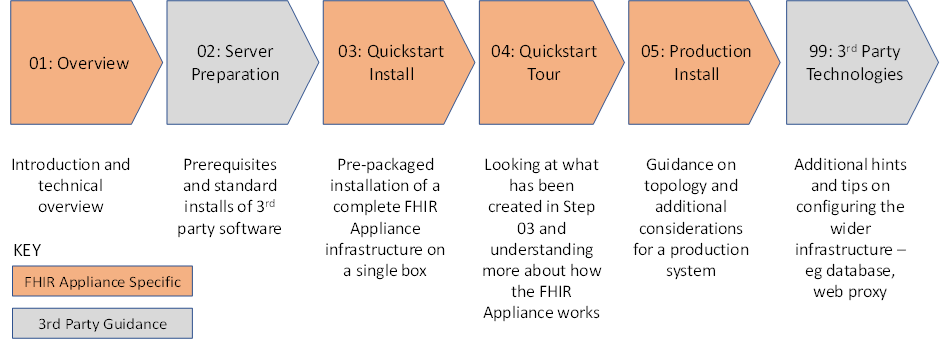
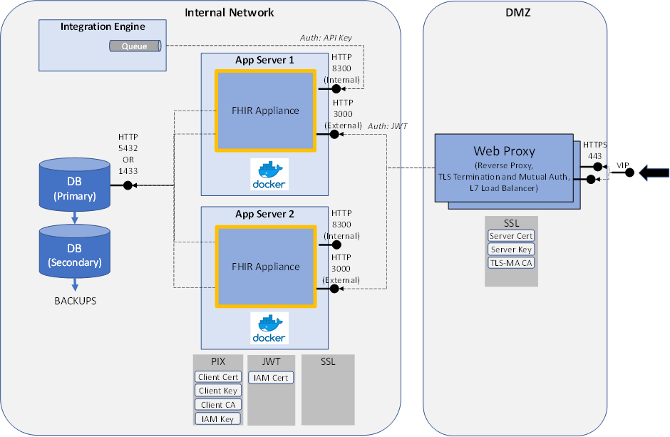
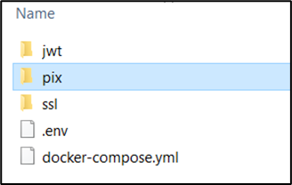
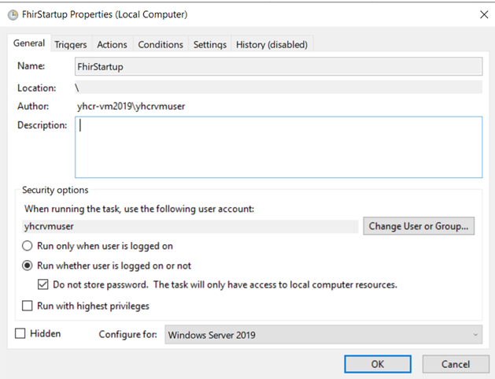
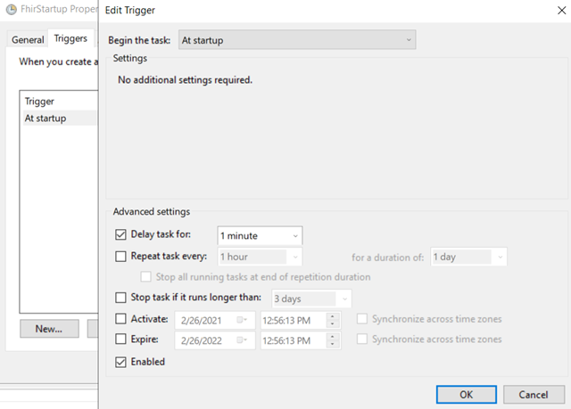
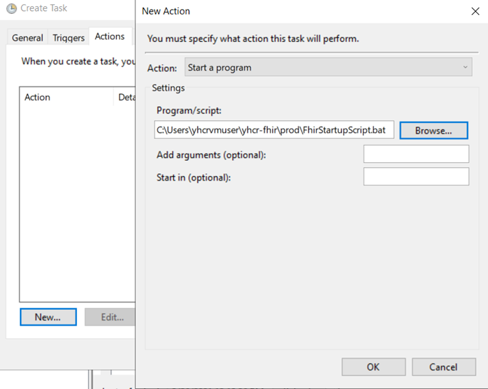

# FHIR Appliance Installation

# 05 – Production Install

**Table of Contents**

[1 Introduction](#introduction)

[1.1 Purpose of this Document](#purpose-of-this-document)

[2 Design Considerations](#design-considerations)

[2.1.1 Resilient deployment of the FHIR Appliance](#resilient-deployment-of-the-fhir-appliance)

[2.1.2 Resilient deployment of the database](#resilient-deployment-of-the-database)

[2.1.3 Network security and Web Proxy](#network-security-and-web-proxy)

[2.1.4 SSL Termination](#ssl-termination)

[2.1.5 Internal vs External connectivity](#internal-vs-external-connectivity)

[3 Illustrative Deployment](#illustrative-deployment)

[4 FHIR Appliance Installation](#fhir-appliance-installation)

[4.1 Production Install Steps](#production-install-steps)

[4.2 Applying Updates](#applying-updates)

[5 Technical Onboarding](#technical-onboarding)

# Introduction

## Purpose of this Document

This document is part of a set which walks through the entire process of
installing the FHIR Appliance and connecting to the messaging exchange.
It is assumed that the preceding document(s) have already been read, and
material already covered will not be repeated.

This document looks at planning for a Production install.

-   It assumes that, based on working through the “quickstart” exercise,
    then you already have a good understanding of the FHIR Appliance
    software, its configuration, and functionality

-   In this document we therefore give guidance on moving from a simple
    demo install to a production configuration. The document collates as
    much real-life experience as possible to help you achieve a
    successful production deployment

**Note that the guidance given here cannot be entirely “step-by-step” or
prescriptive. There are too many variations in local policy and practice
to cover every eventuality. Based on the information provided you will
need to make your own design decisions - and configure your own
infrastructure in a way which combines this guidance with your own
organisation’s security and infrastructure best-practices and
policies.**

# Design Considerations

In this section we highlight some of the key questions which you will
need to consider when designing your production deployment.

***Fundamentally the FHIR Appliance is similar to any other “web app” –
consisting of a server which responds to HTTP(S) plus a database
backend. The headings below provide more detail of these components.
However if you already have an approach to deploying this kind of
standard web-based system then the FHIR Appliance is likely to fit the
same pattern.***

***The only real points of note are the need to use certificates
provided by the messaging exchange for TLS (including Mutual
Authentication), plus the option for an “internal” vs “external” route
into the service.***

**Whilst the rest of this document elaborates in more detail, typically
the main differences from a “quickstart” deployment are:**

-   **Use of a “normal”, dedicated, database server. (As opposed to the
    quickstart containerised option)**

-   **Offloading SSL termination from the FHIR Appliance itself to a
    dedicated Web Proxy server in the DMZ**

-   **Adding additional servers and load-balancing for scale and
    resilience**

### Resilient deployment of the FHIR Appliance

This is the core software provided by to assist with connecting to the
messaging exchange. It provides a stateless RESTful service responding
to HTTP traffic. Resilience is therefore achieved in a similar way to
any other “website” – ie by deploying in a load-balanced configuration
across at least two servers.

### Resilient deployment of the database

Resilience for the database also needs to be planned for, for example:

-   ***Redundancy*** – normal best-practices for avoiding a single point
    of failure in the database need to be considered - whether
    active-passive failover or an active-active cluster. It is beyond
    the scope of this document to cover this, however see ***FHIR
    Appliance Install 99 - 3rd Party Technologies*** for references.

-   ***Backups*** – again it is important that the database is backed
    up, and normal best-practices apply. Backups of the audit schema
    provide an additional function, in terms of providing assurance that
    a temper-proof copy of the audit trail is securely archived

-   ***Management*** – the database needs to be managed and maintained
    in line with normal DBA best-practices

    -   The ***“public” schema*** will contain record(s) for each FHIR
        Resource published – in many cases this is likely to consume
        only a small amount of storage. A fast response to queries on
        the indexes will be required.

    -   The ***“audit” schema*** will contain record(s) for each request
        made to the FHIR server. Depending on traffic this could get
        large. It is however append-only, and with queries likely to
        be rare.

Note that it is possible to co-locate the FHIR Appliance and Database on
a single server if desired for test deployments. However, as for any
application, the different characteristics of an application server vs
database mean that dedicated servers are best-practice for production.

### Network security and Web Proxy

It is assumed that, as with any web application, the production FHIR
Appliance will not be directly connected to external networks – rather
it will be protected by a DMZ and Reverse Proxy layer.

The external-facing endpoint will need to present a static IP address
which can be configured in the central messaging exchange to route
messages to your organisation. (The messaging exchange does not by
default use public DNS routing). Your organisation’s firewalls will also
need to be opened to allow access for HTTPS traffic from the messaging
exchange’s static IP address.

### SSL Termination

Related to the previous point is deciding where SSL from incoming
connections will be terminated. Key points to consider are:

-   It is required to use certificates signed by the messaging exchange
    for SSL

-   It is also required to TLS Mutual Authentication (client
    authentication) using certificates signed by the messaging
    exchange

You will also need to consider whether or not SSL is furthermore needed
for traffic on your own internal networks.

Planning will therefore be needed as to how these certificate
requirements are incorporated. It is obviously easiest on a separate web
server, however most modern web servers also provide options to
configure multiple services on a single box. ***FHIR Appliance Install
99 - 3rd Party Technologies*** provides further references.

### Internal vs External connectivity

-   The main “external” route to the server will come via the network
    security layers discussed above, and will require signed JWT
    tokens to be included with each message.

-   There may also be a need for internal services (eg the integration
    engine loading the data) to connect, and therefore an option to
    have a simpler “internal” route for these to use.

# Illustrative Deployment

This section provides an example of how a deployment might look, based
on the considerations above.

***IMPORTANT: This example is illustrative only and is not the “right”
or “only” answer. You will need to design your own deployment based on
knowledge of your own internal infrastructure and policies.***

Points of note in the diagram include:

-   The ***FHIR Appliance*** software is hosted on Docker, via a Docker
    Compose file

    -   It is deployed across two application servers for resilience.

    -   It includes an internal endpoint (listening on Port 8300), plus
        an external endpoint (listening on Port 3000). Both endpoints
        use http - as https termination is offloaded to the web proxy.

    -   The external endpoint has full jwt authentication configured.
        The internal endpoint has simpler API Key authentication
        configured

    -   Auto-PIX registration is also configured

-   The ***database*** is deployed in an active-passive configuration –
    with a primary and log-shipping to a secondary replica. (Other
    options include an active-active configuration)

-   A resilient ***Web Proxy*** layer is deployed in the DMZ, to provide
    reverse-proxy and Layer 7 Load Balancing services. It offers a
    static VIP for the messaging exchange to connect to and provides TLS
    termination using the centrally-signed certificates for both
    encrypting the connection and TLS Mutual Authentication. (The
    diagram shows dedicated infrastructure, however there would also be
    options for segregated configuration and routing on shared web proxy
    infrastructure).

-   ***Network connections within the organisation*** are shown using
    HTTP. Alternatively it might be required to enable SSL for some or
    all of the internal connections. The FHIR Appliance has the option
    to enable SSL on an endpoint if required.

-   The ***integration engine*** is shown with a very simple
    configuration connecting to one of the FHIR Appliance instances.
    This assumes that resilience would be provided via queuing and
    retries, with application-level monitoring and error handling to
    trigger switching to the other server in the event of an outage.
    (Alternatively it could be connected to an internal load-balancer
    across the two application servers)

-   ***Disaster Recovery*** is not explicitly shown in the diagram, but
    the secondary database might normally be on a remote site. The other
    servers are stateless and could have server images replicated for
    warm or cold standby to a remote site. Other more elaborate
    active-active arrangements would also be possible – the FHIR
    Appliance is no different to any other 3-tier application in this
    respect.

# FHIR Appliance Installation

Having considered the end-to-end design, this section walks through the
detailed production installation of the FHIR Appliance component.

## Production Install Steps

1.  **Prepare the server**

-   See the instructions in document ***FHIR Appliance Install 02 -
    Server Preparation*** for more details, including server
    prerequisites and advice on installing docker

2.  **Copy on production configuration**

-   In a browser go to
    <https://github.com/yorkshire-and-humber-care-record/fhir-appliance>,
    look for the green “Code” button, select “Download ZIP”, and unzip
    the files

> The location of the install on the server is your choice
>
> Once you have a copy of the files downloaded then look inside the
> “prod” folder

3.  **Install other servers and components**

-   You will need to provision other servers and install any other
    3rd party components – eg database, web proxy. It is
    beyond the scope of this document to provide detailed instructions
    for these external components – but see “***FHIR Appliance Install
    99 - 3rd Party Technologies***” for links and tips which may be
    useful.

-   Note that you will need to have at least a working database
    connection to run the FHIR Appliance for an initial internal test.
    This includes:

    -   Creating a database called “fhirstore”

    -   Creating a logon for the FHIR Appliance to use, and setting as
        owner of the fhirstore database

    -   Opening firewalls and database connectivity between the FHIR
        Appliance and database servers

> **Database scripts are provided in the “misc” folder to automate the
> database and user setup for both postgress and MSSQL.**
>
> See also “***FHIR Appliance Install 99 - 3rd Party Technologies***”
> for further tips on these tasks

4.  **Review configuration files in the “prod” folder**

-   ***docker-compose.yaml*** – this is the main Docker Compose
    configuration file which describes the environment.

    -   ***Choose your flavour*** – you will see the “image:” details,
        with an obvious choice between Linux or Windows 2019 for each
        instance. Comment in/out the appropriate lines to make your
        choice. There are also some small differences in the way
        volumes are mounted. Again comment in/out the appropriate
        lines to make your choice

    -   ***Confirm ports*** – default port settings are configured,
        however this is easy to change if desired. Be careful to make
        sure that the ports in this file are aligned with those in the
        .env file

-   ***.env*** – configuration file for the FHIR Appliance.

    -   This file will need working through carefully and appropriate
        settings making. Further detailed comments and instructions
        can be found in the configuration file itself.

    -   It is useful to look at the “quickstart” example files for
        “typical” settings which you may wish to copy

    -   See also ***FHIR Appliance Install 03 - Quickstart Install***
        for further details

5.  **Check internal firewalls**

-   You will need to make sure that any internal and/or server firewalls
    are open for the necessary connections – eg to access the FHIR
    Appliance ports, and for the FHIR Appliance to connect to the
    database. (For example Windows Firewall will block all of these by
    default)

6.  **Run up the system**

-   Ensure your current directory is the “prod” directory where the
    “docker-compose.yml” file is located

-   Enter the command to spin up the installation: ***docker-compose
    up***. (On Linux this may need to be prefixed with sudo).

    -   As usual, the first time will be slow as it downloads all of the
        docker images. Subsequent runs will be much faster

7.  **Smoke Test**

-   The most obvious basic test is to try
    ***http://localhost:8300/fhir/stu3/metadata**.* (NB: If you plan to
    configure API authorisation, then you may want to temporarily turn
    it off to try this initial smoke-test)

-   You can also try
    [***http://localhost:3000/fhir/stu3/metadata***](http://localhost:3000/fhir/stu3/metadata)
    – which should return an Operation Outcome stating “Unauthorised
    request”

-   You can also try just
    [***http://localhost:8300***](http://localhost:8300) and
    [***http://localhost:3000***](http://localhost:3000) – both of
    which should return simply “Ping”. This can be useful for
    healthchecks - as this check is not affected by JWT verification.

<!-- -->

-   See ***FHIR Appliance Install 03 - Quickstart Install*** for more
    details of initial testing and troubleshooting

8.  **Configure Autostart**

The FHIR Appliance needs to autostart when the server reboots.

-   **On Linux**

1.  Ensure the Docker Compose file is configured with ***restart:
    always*** for the containers which you want to autostart. (This is
    already the case in the provided docker compose files)

2.  Set the service running in the background with docker-compose up -d

3.  Nothing else is necessary on Linux – the docker daemon and
    containers will autostart when the server boots.

4.  Test to make sure – eg reboot and check ***docker ps***

-   **On Windows Server**

> The steps above do not appear to be sufficient on Windows Server. It
> appears to be necessary to run a script on system startup.

1.  Use Control Panel / Services to check that the Windows docker
    service itself is configured to autostart (by default it should be)

2.  Create a start up script eg a .bat file containing:

> ***cd** \<the “prod” directory containing the prod docker-compose
> file>*
>
> ***docker-compose down***
>
> ***docker-compose up -d***
>
> (The ***docker-compose down*** line was added based on experience that
> sometimes debris can remain when the server is switched off. Startup
> was found to be more reliable with this precaution)
>
> ***See also example script in the “misc” folder of the installation***

3.  Test the script by running it manually to make sure that it works.

<!-- -->

<!-- -->

4.  This script then needs to be scheduled on system startup – there are
    several ways to do this and you may have your own preferences. One
    method which the author tested successfully was using Windows Task
    Scheduler:

    -   Create a new task

        -   Needs to run whether a user is logged on or not (but does
            not seem to require a password)

        -   Configure for the correct operating system

-   Trigger “At startup”

    -   **The 1 minute delay appears to be very important**. If the task
        attempts to run too soon – eg before other services have
        started, then it will fail.

-   Action - to run your start-up script

5.  Test this configuration – eg reboot and check ***docker ps*** to
    confirm the services are running

## Applying Updates

There are two reasons why updates to the FHIR Appliance will be issued:

1.  **Functional enhancements** (including bugfixes) – these will be
    notified via the normal release process. To-date the FHIR Appliance
    has been stable and these have been rare.

2.  **Regular security patching** – a docker image encapsulates a “full
    stack” including operating system. Therefore the images need to be
    regularly rebuilt to incorporate any operating system patches. This
    will be done monthly (aligned with Microsoft Patch Tuesday) for both
    Windows and Linux. No additional announcements will be made about
    this.

In either case you will need to upgrade to get the new image

**Upgrade scripts (for both Linux and Windows) are provided in the
“misc” folder**

**It is recommended to schedule these scripts to run at least monthly -
to ensure you have the latest, fully patched, version of the image.**

# Technical Onboarding

**Once you are satisfied with your installation from an internal
perspective then it is time to move to the final step of connecting to
the messaging exchange via the Onboarding process.**

The Onboarding Suite website is provided to assist with these technical
onboarding steps. In essence the process involves registering for an
account, and providing various information – including contact details,
plus technical details such as IP addresses. You are then provided with
details of the relevant messaging exchange endpoints, plus credentials
to connect. This document is not intended to be a user guide for the
Onboarding Suite itself – but rather to highlight the local technical
configuration needed as part of using this tool.

The two main activities are:

1.  **Configuring IP addresses, endpoints and firewalls**

    -   You will provide your environment’s IP address to the Onboarding
        Suite – which will be used for routing and/or to open any
        necessary firewalls on messaging exchange side

    -   The Onboarding Suite will provide details of the messaging
        exchange’s IP address and endpoints – which will similarly
        need to be used to open relevant firewalls for the messaging
        exchange to gain access into your organisation’s
        infrastructure.

2.  **Obtaining certificates, keys, and credentials**

> Essentially this involves replacing any self-signed credentials which
> you may have used for the “quickstart” exercise with properly signed
> certificates from the central exchange.

-   Screens are provided to guide you through this process – downloading
    configuration templates (cnf) and using OpenSSL to generate
    private keys (key), and then submit certificate signing requests
    (csr) to obtain the corresponding signed certificates (crt or pem)

-   Note that the cnf and csr files are temporary artefacts, and no
    longer needed once you have key and certificate which they help
    you to generate

-   You can also download the relevant public root certificates

> For the most part, this will provide the information needed to
> populate the “jwt” and “pix” folders, plus to complete the
> configuration settings in your .env file. The exception is the SSL
> keys and certificates - which will most likely need to be installed on
> a separate web proxy server.

Once configuration is complete then the Onboarding Suite can also help
test the connection.
