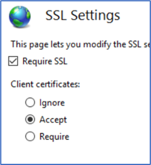
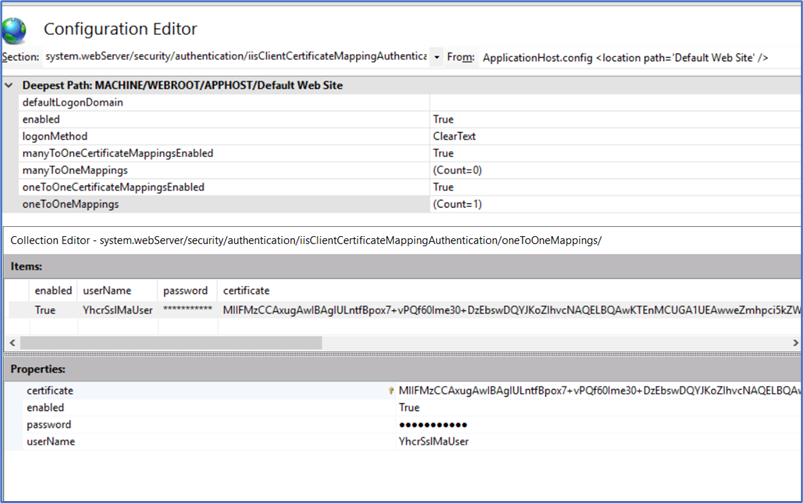

#FHIR Appliance Installation

#99 – 3rd Party Technologies

**Table of Contents**

[1 Introduction](#introduction)

[1.1 Purpose of this Document](#purpose-of-this-document)

[2 Postgres](#postgres)

[2.1 Installation](#installation)

[2.2 FHIR Store Database Setup](#fhir-store-database-setup)

[2.3 Backups and High Availability](#backups-and-high-availability)

[2.4 Enterprise Support](#enterprise-support)

[3 IIS](#iis)

[3.1 Install IIS (including security options , plus ARR)](#install-iis-including-security-options-plus-arr)

[3.2 Manage Certificates](#manage-certificates)

[3.3 Configure SSL](#configure-ssl)

[3.4 Configure IIS Load Balancing (Server Farm)](#configure-iis-load-balancing-server-farm)

[3.5 Configure Mutual Authentication](#configure-mutual-authentication)

[3.6 IIS Reverse Proxy option](#iis-reverse-proxy-option)

[4 Other Web Proxies](#other-web-proxies)

[4.1 NGINX](#nginx)

# Introduction

## Purpose of this Document

This document is part of a set which walks through the entire process of
installing the FHIR Appliance and connecting to the messaging exchange.
It is assumed that the preceding document(s) have already been read, and
material already covered will not be repeated.

This document provides additional guidance on some of the 3rd
party technologies which are anticipated to be needed around the FHIR
Appliance itself in a production deployment. For example, databases and
web proxies.

***Note that this paper is entirely concerned with industry-standard
technologies which are not directly provided by this project.***

***Considerable research has been put into preparing the notes and they
have been carefully tested – the aim is to help get your installation
working as quickly and easily as possible.***

***However ultimately this project cannot be responsible for
configuration of these 3rd party technologies, and you may
need to supplement these notes with your own expertise and with
knowledge of your own specific environment and organisational
standards.***

# Postgres

In this section we cover the basics of installing and configuring a
standalone (non-docker) Postgres database server for use with the FHIR
Appliance.

***The aim is to provide enough information to help you get started and
to point out any specifics relevant to this installation. However it is
beyond the scope of these documents to provide Postgres DBA training.
You will need to supplement these notes with your own learning if you
are planning a production deployment and Postgres is new to you.***

***Note: Another option would be to use a cloud service. Most of the
major cloud providers offer a fully managed Postgres
database-as-a-service, so if your organisation is already using the
cloud then this option may be attractive.***

## Installation

Note: For a test system it is possible for the database to be co-located
on the same server as the FHIR Appliance. For a production system then
it is best-practice to host the database on a dedicated server.

1.  **Run installation (including pgAdmin client)**

-   From the Postgres website, follow the download link and install
    Postgres v11.x <https://www.postgresql.org/>

-   On Windows, the installation wizard also includes by default the
    pgAdmin client. Or otherwise install from the website:
    <https://www.pgadmin.org/>

The pgAdmin client is exposed (by default) on
<http://127.0.0.1:50198/browser/>, or on Windows a link is also added
under the “Postgres” folder in the Start Menu

-   The Windows installation wizard also offers a link to the “Stack
    Builder” tool which is worth looking at for various additional tools
    and utilities which may be useful

2.  **Open server firewalls**

-   After installation, please check that any firewall software running
    on the server allows inbound TCP/IP and UDP from necessary sources
    (eg the FHIR Appliance server) to the PostGreSQL Server service
    (port 5432).

> *Note: This may be necessary to configure even on a test server where
> the database and FHIR Appliance are running on the same box.*

3.  **Enable database connections from the FHIR Appliance**

> Connections to the database are controlled by the Postgres
> configuration file ***pg_hba.conf***, which you will need to edit to
> allow a connection from the FHIR Appliance:

-   Stop the PostGreSQL Server Service

-   Open \[PostGres Installation
    Path\]\\PostGreSQL\\11\\data\\pg_hba.conf in a text editor.

-   Under the section called "IPv4 local connections" add a new entry

> ***host all all \[FHIR APPLIANCE IP\]/32 password***
>
> For example: ***host all all 10.1.4.5/32 password***

-   Save the file and restart the PostGreSQL Server Service.

## FHIR Store Database Setup

NB: A SQL script is provided in the “misc” directory of the download
which can perform these steps of creating a user and database.
Alternatively this can be done via the pgAdmin client user interface as
follows:

1.  **Connect to the database server using the pgAdmin client**

-   Right click on “Servers”, select “Create >”, “Server…” and fill out
    the dialog box.

-   Give it a name (eg fhirstoredb)

-   On the “Connection” tab then the Host is the name or ip address of
    the server, the Username is by default “postgres” and the password
    is whatever you set as the master password on database creation

2.  **Create a new database named fhirstore**

-   (Right click on databases, “Create >”, “Database…”)

3.  **Create a new login/group role for the FHIR Appliance User, and
    make owner of the fhirstore database.**

-   Right click on the Sever (eg fhirstoredb), “Create >”, “Login/Group
    Role…”

-   Enter a user name (eg iamonfhir) in the name field (General tab)

-   Enter a password field (Definition tab)

-   Switch all the options in the Privileges tab to Yes

-   Select the fhirstore database and change the owner to iamonfhir
    (Right click on the data, “Properties…”, General tab

> This username and password are what the FHIR Appliance will use when
> connecting to the database. For example it will need to be configured
> in the FHIR Appliance .env files as part of the database connection
> string.

4.  **Create the database tables needed by the FHIR Appliance**

-   These are created automatically by the FHIR Appliance the first time
    it runs

## Backups and High Availability

For a production server it is important to configure backups and high
availability

1.  **Configure backups**

-   Information about configuring backups can be found here:

<https://www.postgresql.org/docs/current/backup.html>

-   Postgres offers several backup options, and further guidance can be
    found online – for example:

<https://www.enterprisedb.com/blog/postgresql-database-backup-recovery-what-works-wal-pitr>

-   It is worth noting that the two schemas created for the FHIR
    Appliance have significantly different characteristics

    -   The main “public” schema contains the FHIR Resources, and will
        be critical to restore quickly to get running again in the
        event of a disaster

    -   The “audit” schema is vital to archive securely to preserve an
        audit trial. However it has potential to grow large, and it
        would not be vital to immediately restore the historical audit
        trail to restart operations after a disaster

There may therefore be benefit in separate backups of the two schemas.

2.  **Configure high availability**

-   Information about configuring high availability can be found here:

<https://www.postgresql.org/docs/current/high-availability.html>

-   Again there is further guidance available online, for example:

<https://www.enterprisedb.com/postgres-tutorials/how-implement-repmgr-postgresql-automatic-failover>

-   There are also various replication tools available (some free and
    others licensed) which may relevant.

## Enterprise Support

Whilst Postgres is free, several companies offer enterprise support
agreements if this is desired. For example, the Postgres download page
is sponsored, and other companies offer similar services. As noted
above, most cloud providers also offer a fully managed Postgres
database-as-a-service.

# IIS

In this section covers the basics of installing and configuring
Microsoft Internet Information Server on Windows Server 2019 - to
provide reverse proxy and load balancing services. We also look at
installing certificates for TLS including Mutual Authentication

***The aim is to provide enough information to help you get started and
to point out any specifics relevant to this installation. However IIS is
a complex product and configuring it in a correct and security-hardened
manner is non-trivial. You will need to supplement these notes with your
own learning if you are planning a production deployment and IIS is new
to you.***

***Tip: If any of the following steps are unfamiliar then it is highly
recommended to do a practice-run using your own self-signed
certificates***.

Self-signed certificates are easy to generate using OpenSSL (see
Appendix of ***FHIR Appliance Install 03 - Quickstart Install*** for
details), and also a full set for testing are provided in the
“***misc***” folder of the install. Taking this approach of
experimenting with your own certificates lets you test everything in
isolation, before adding the additional complexity of external
connections to the messaging exchange. It also means that you have all
of the private and public keys available to fully test– whereas with the
actual remote configuration then some of the private keys will obviously
be withheld.

## Install IIS (including security options , plus ARR)

1.  **Install IIS**

-   In Server Manager, “Add roles and features”, and add the “Web Server
    (IIS)” feature

-   Under “Security”, make sure that the following options are ticked,
    as they may be needed for configuring TLS Mutual Authentication:

    -   Client Certificate Mapping Authentication

    -   IIS Client Certificate Mapping Authentication

    -   URL Authorization

2.  **Install the Application Request Routing (ARR)**

-   This enables reverse-proxy features, and can be got from:
    <https://www.iis.net/downloads/microsoft/application-request-routing>

3.  **Check it is working**

-   Browse to <http://localhost> where you should see the IIS home page

## Manage Certificates

*Note: In IIS all certificates are managed at the server level. Once all
necessary certificates are installed on the server then specific
certificates are referenced as required to enable SSL on particular
“Site”*

1.  **Open the IIS Server Certificates tool**

-   Open IIS Manager

-   Select the top-level node representing the entire Server, and then
    select “Server Certificates”

Here there are many options to work with certificates

2.  **Create an IIS Generated Certificate for SSL (optional)**

> If you just want to get SSL working quickly, you can simply take the
> option to “Create Self Signed Certificate”.

-   Give the certificate a “Friendly Name”, and select the “Web Hosting”
    store

-   You can now use this self-signed certificate to enable SSL for a
    website (see next section)

> Whilst this is very easy, it is not so helpful for our purposes - as
> we will want to enable SSL by importing specific certificates (eg
> provided by Onboarding, or our own self-signed certificates for
> testing).

3.  **Importing a Certificate for SSL**

> Importing a certificate is more useful for our purposes, and is also
> straightforward:

-   Select “Import…”

-   Browse to the pfx file that you wish to import

-   Enter a password (if necessary), and select the “Web Hosting” store

> Whilst this is simple enough, the challenge is where to get a pfx file
> from - as this is not what you get back from the Onboarding process.

4.  **Generating a pfx file**

A pfx file is a “bundle” which combines together:

-   The **public certificate** (crt or pem – these file types are
    interchangable)

-   The **private key** (key)

-   If necessary, the **root certificate** (crt or pem) which proves the
    bone-fides of the public certificate

You can easily demonstrate this for yourself using Open SSL:

-   First generate a self-signed key pair for testing:

***openssl req -x509 -newkey rsa:4096 -sha256 -keyout testSSL.key -out
testSSLl.crt -subj "/CN=yourservernamehere" -days 600 -nodes***

-   Then combine the key and crt files into a single pfx file:

> ***openssl pkcs12 -export -out testSSL.pfx -inkey testSSL.key -in
> testSSL.crt name MyTestSSLCertificate***
>
> This will prompt for a password to secure the pfx file – and it is
> good practice to provide one, or alternatively just press “enter”

-   Your pfx file can now be imported as a Certificate into IIS

> However our goal is to achieve this feat with the SSL certificate
> provided by Onboarding. To understand how this will work, it is worth
> remembering the steps of the onboarding process which are (you do not
> necessarily need to actually do this now):

1.  Use OpenSSL to generate a private key (key) and certificate signing
    request (csr)

2.  The csr is uploaded, gets signed, and comes back as an SSL Server
    Certificate (crt)

3.  You will also need the Root CA Certificate, which is used to verify
    the signature on the cert

-   These <u>three</u> ingredients are then combined in a similar way as
    the previous example to create the pfx file:

> ***openssl pkcs12 -export -out YHCRServerSSL.pfx -inkey
> YHCRServerSSL.key -in YHCRServerSSL.crt -certfile YHCRRootCA.crt name
> YHCRServerSSLCertificate***
>
> (NB: the actual filenames of the key and crt or pem files will be
> different – the above is illustrative)

-   As before, the resulting pfx file can now be imported as a
    Certificate into IIS

## Configure SSL

*Note: Before beginning it is worth noting that in IIS the SSL settings
are per “Site”. Therefore if the IIS server is shared with other
websites and applications, it is likely that you will want to configure
a new “Site” to manage the specific TLS settings and certificates
required.*

Once the certificates are imported (see above) then configuring SSL is
straightforward:

1.  **Edit the site Bindings**

-   Open IIS Manager

-   Right click on the Site and select “Bindings”

-   Select “Add”, choose “https” from the dropdown, select the correct
    certificate from the dropdown – then press “OK”. (This assumes you
    have already followed the steps above to load the certificate into
    IIS. It will then appear in the dropdown on this screen)

-   To enforce HTTPS only - in the list of bindings, select the http
    Binding, and click “Remove”

-   Finally click “Close”

2.  **Enable SSL**

-   Now go back and select the Site, and select “SSL Settings” (the
    padlock icon)

-   Tick the box for “Require SSL”, and press “Apply”

Traffic to the website is now secured using SSL with your chosen
certificate. For more details and screenshots, see (for example)
<https://techexpert.tips/iis/enable-https-iis/>

## Configure IIS Load Balancing (Server Farm)

1.  **Create a Server Farm**

-   Open IIS Manager

-   Right click on Server Farms, and select “Create Server Farms”

-   Give the farm a name

-   Add server(s) to the farm – enter the IP address(es) of the FHIR
    Appliance server(s)

> NB: You may wish to change the backend port – for example the FHIR
> Appliance “secured” endpoint (with JWT token verification) listens by
> default on port 3000. This can be done when adding the server by
> clicking on “Advanced Settings…”. As far as the author can see there
> is no other way to ever view or edit this setting if you miss this
> opportunity!
>
> 

-   Say “yes” to the suggestion of a rewrite rule

2.  **Configure a Health Test**

It is possible to configure a “URL Test” using the root url of the FHIR
Appliance (ie \>) . This returns a “Ping” response – and this works even
if JWT validation is enabled for requests to the FHIR Server itself.
This is therefore useful for a URL health test:

-   Try it for yourself in a browser – enter the url > , and see the
    response “Ping”

-   Back in IIS Manager, click on the Web Farm, and then on the Health
    Check icon

-   Configure the URL as >, and the Response match as “Ping”

-   Press “Verify URL Test” to check it is working

***Note that this is a <u>single</u> URL for the “frontend” website. IIS
does not appear to offer a way to direct healthchecks at specific
“backend” servers.***

Notice that there is also an option for a “Live Traffic Test”, however
this is more problematic. The FHIR Appliance currently seems to be quite
enthusiastic in its use of HTTP 500 responses – for example a 500 is
returned if JWT verification fails. Therefore the Live Traffic Test may
be better left on the default, disabled, settings.

The following link provides useful further details of these IIS
healthcheck features:
<https://blogs.iis.net/richma/application-request-routing-health-check-features>

3.  **Review other Server Farm Settings**

The other options for a Server Farm are reasonably self-explanatory and
covered by Microsoft documentation, however a few points of note are:

-   **Load Balance**

Contains a choice of algorithms for distributing requests

-   **Monitoring and Management**

Shows some useful statistics, and is also the place where you can
right-click on a server to adjust its healthy / unhealthy status

-   **Routing Rules**

Contains the tickbox for “***SSL Offloading***”.

If ticked it will forward requests to the backend (eg FHIR Appliance)
on http, which is the default and simplest option. This also allows
the possibility of configuring just an IP address for the back end
servers – ie a host name is also possible but not necessary.

If not ticked it will use https, which does provide an extra layer of
security (if required) whilst traversing the internal network – but
will require additional SSL configuration of the FHIR Appliance
backend. It will also require a proper host name – ie with either DNS
or “hosts” routing configured. IIS does check the backend certificate
against the hostname in the configured URL, and will error on a
mismatch.

There is also an option for “***Advanced routing***” - where this
http/https choice for the backend connection can be seen and edited
more directly, along with many other advanced settings. This includes
a “***Conditions***” option which can be used to control which type of
requests (eg by host, path, etc) come through to this server farm.
This may be useful if, for example if there are multiple sites and
applications on the IIS Server. For more details see also:

<https://improve.dk/setting-up-multiple-iis-application-request-routing-farms-on-the-same-server/>

-   **Server Affinity**

The FHIR Appliance is stateless – so there should be no need to
configure server affinity

## Configure Mutual Authentication

***NB: Before starting on this activity, it is worth noting a couple of
characteristics of IIS which make TLS Mutual Authentication more
complicated to configure than might otherwise be expected:***

1.  **Server-wide Trusted Root CA certificate store**

Trusted Root CA certificates are imported to the Windows server-wide
store. This means that a “simple” implementation of TLS-MA on IIS may
be easily configured to require a certificate, but that this will
accept a certificate from ANY of the many Trusted Root CAs in the
Windows certificate store! Thus the site is not, by default, locked
down to enforcing credentials from <u>only</u>, say, the messaging
exchange’s CA.

2.  **Single Healthcheck URL**

IIS Web Farms do not allow configuration of healthchecks directly to
the backend servers. Rather there is a single URL to check the
<u>frontend</u> website. There is also no way for this URL to present
any credentials. This means that if the website is locked down with
TLS-MA, then the healthchecks will be unable to get through – and the
entire site will go “unhealthy” and take itself down!

The steps below suggest a workaround to these IIS limitations which is
based on:

-   Requiring not just any trusted certificate, but a <u>specific</u>
    certificate. This extra check can be done in IIS by mapping that
    certificate to represent a “user” identity, and then locking the
    site to prevent “anonymous” access

-   Leaving the root of the website open - to allow the “Ping”
    healthcheck response to continue. Additional configuration is
    instead used to apply the TLS-MA lockdown only to the “/fhir”
    subdirectory

The remaining steps go into more detail around these basic ideas. The
author would welcome comments from any IIS experts if a neater solution
can be proposed.

**Note on testing:**

In order to test the configuration at each step, it is useful to have
the following three tests prepared:

1.  \> - this is the basic “Ping” test, to be run in a client with no
    certificates (eg a simple browser tab). This should always work

2.  \- to be run in a client with certificate credentials configured (eg
    Postman). This should always work

3.  \- to be run in a client with no certificates (eg a simple browser).
    This should work at the start, but NOT work by the end of the
    exercise

(Note that “work” in this context may mean returning an Operation
Outcome to inform that the JWT token is invalid. The key point being
that this is a response from the FHIR Appliance, as opposed by an
authentication / authorisation rejection from IIS)

1.  **Import Root CA to Trusted Store**

-   Open the Windows Certificate Manager Tool (ie NOT in IIS)

-   Navigate to the Trusted Root Certification Authority folder, and
    “Import” the certificate

This step is very straightforward, but points to note include:

-   Notice the long list of trusted roots in the store – by default ANY
    of these would unlock the site! (We will lock this down shortly)

-   If you have a “.pem” file then, although not listed, this will also
    work. Just change the options to “All Files” and select it

-   If you are testing with self-signed certificates then you may not
    have a root CA. Just import the Self-Signed certificate itself.

2.  **Enable (but do not enforce) Mutual Authentication for the site**

-   Back in IIS Manager, select the site, and then SSL Settings (the
    padlock icon)

-   On Client Certificates, choose the option for “Accept”

This choice merits some discussion. At this point we have changed very
little, and all 3 of the test cases should still work. All that is
happening is that IIS is now “looking” for a certificate and processing
it if it finds one. However nothing is enforced.

(You could try experimenting with “Require” to see what happens. As you
might expect the test case which presents a certificate continues to
work for a short while, whilst the other tests should fail. However this
failure includes the “Ping” Health Check – and once the Web Farm notices
then the site will go down entirely! You will need to reset it to
“healthy” from within the Web Farm “Monitoring” option).

3.  **Create a user account**

This is just a normal Windows user account – for example in Computer
Management, Local Users and Groups. You may want to make sure that the
password does not expire. This is the user which we will map to the
certificate.

4.  **Map Certificate to User**

-   In IIS Manager, on the Site, select “***Configuration Editor***”
    (the icon of a piece of paper)

-   Select the setting
    “*webserver/security/authentication/iisClientCertificateMappingAuthentication*”,
    and make sure it is “enabled” (This assumes that the feature is
    installed – see the first step of installing IIS).

-   In the details, make sure that
    “*oneToOneCertificateMappingsEnabled*” is true, then click on the
    “…” to the right of “(Count=1)”

-   In the properties dialogue enter the username and password of the
    user you have created, plus paste in the relevant certificate.
    (This is a bit fiddley – you need to remove any “--- BEGIN
    CERTIFICATE ---“, “--- END CERTIFICATE---” statements, plus remove
    all newlines. So just one long string of characters)

*At this point all 3 tests should still work, however there is now a
subtle difference. The two tests without credentials are still running
as the “anonymous” user. However the test with the credentials has now
had its certificate inspected and verified (via the “SSL Settings =
Accept” choice), and has been mapped to a user (via the above
configuration). It is no longer anonymous, but is running as this user.*

5.  **Lock down the /fhir directory with a Location Tag**

With all of the preparations in place, finally we are ready to lock down
the site. The goal is to leave the top-level open (for the “Ping”
healthchecks), but lock down the “/fhir” directory. There does not
appear to be a way to do this from the IIS Manager user interface – it
is necessary to edit the IIS configuration files manually.

-   Edit ***applicationHost.config*** – this can be found in
    ***Windows/System32/inetsrv/config***

-   The file is large, but you are looking for a section like this
    (probably at the bottom). It is fairly easy to see how this
    encodes the settings that we have just been making in the UI.

-   Leave this section alone, but make a second copy immediately
    underneath and edit it as follows (you can also find an example in
    the “misc” folder of the install)

-   Important points in this configuration are:

    -   ***location path*** – states that this configuration applies to
        the “fhir” directory only

    -   ***sslFlags – SslRequreCert*** means that a valid certificate
        (albeit from ANY of the trusted CAs) must be presented to get
        in.

> *Note: the author has had some difficulties with this setting
> mysteriously locking out even when a valid certificate is presented.
> It would be possible to “turn it down” to SslNegotiateCert and still
> be protected by the other authentication settings.*

-   ***authentication*** – most important is that
    anonymousAuthentication is “false” - so anonymous users are locked
    out. And clientCertificateMappingAuthentication is “true” – and so
    the only way to acquire an identity and get in here is by matching
    with the certificate configured in the previous section.

At this point the task should be complete, and you should rerun the 3
tests to confirm. Ping should still be working, the metadata query with
a certificate should still be working, but the metadata query without a
certificate should be blocked.

To be extra sure, you could edit the applicationHost.config file and
temporarily “sabotage” the certificate string (eg change a character).
This should cause even the test presenting a “valid” certificate to be
locked out – because it does not match the one-and-only certificate
configured to access this site.

6.  **Further Reading**

The following links have been useful in researching this section, and
may be of interest:

<https://www.lucadentella.it/en/2018/04/18/iis-mutua-autenticazione-con-certificati-ssl/>

<https://hafizmohammed.medium.com/configuring-client-certificates-on-iis-95aef4174ddb>

<https://medium.com/@yildirimabdrhm/configuring-iis-for-client-certificate-mapping-authentication-d7f707506a97>

<https://hostadvice.com/how-to/how-to-configure-iis-user-authentication/>

<https://docs.microsoft.com/en-us/iis/get-started/planning-your-iis-architecture/deep-dive-into-iis-configuration-with-iis-7-and-iis-8>

## IIS Reverse Proxy option

Finally, it is worth mentioning that IIS can also be configured as a
reverse proxy. This is a somewhat simpler configuration – it could be
seen as an alternative to the Web Farm and it just passes traffic
through to a single backend with no load balancing.

This might be relevant if IIS is being used in a “simpler” way to offer
SSL termination – for example maybe just used with self-signed
certificates to provide encryption of network traffic across an internal
network link.

Further details can be found here:

<https://techcommunity.microsoft.com/t5/iis-support-blog/setup-iis-with-url-rewrite-as-a-reverse-proxy-for-real-world/ba-p/846222>

# Other Web Proxies

## NGINX

Very similar topics as for IIS will need to be considered for NGINX – ie
configuring SSL, Mutual Authentication, and Load Balancing. However this
should be a simpler – given NGINX’s more straightforward design in terms
of probing backend servers and assigning client certificates to
services.

The following links cover installing NGINX:

<https://www.digitalocean.com/community/tutorials/how-to-install-nginx-on-ubuntu-18-04>

<http://nginx.org/en/docs/windows.html>

The following links cover configuring SSL, Mutual Authentication, and
Load Balancing:

<http://nginx.org/en/docs/http/configuring_https_servers.html>

<https://docs.nginx.com/nginx/admin-guide/security-controls/terminating-ssl-http/>

<https://smallstep.com/hello-mtls/doc/server/nginx>

<https://docs.nginx.com/nginx/admin-guide/load-balancer/http-load-balancer/>

More time could be spent fleshing out further examples on request.
