# FHIR Appliance Installation

# 99 – 3rd Party Technologies

**Table of Contents**

[1 Introduction](#introduction)

[1.1 Purpose of this Document](#purpose-of-this-document)

[2 Postgres](#postgres)

[2.1 Installation](#installation)

[2.2 FHIR Store Database Setup](#fhir-store-database-setup)

[2.3 Backups and High Availability](#backups-and-high-availability)

[2.4 Enterprise Support](#enterprise-support)

[3 IIS](#iis)

[3.1 Install IIS (including security options, plus ARR)](#install-iis-including-security-options,-plus-arr)

[3.2 Configure IIS as a Reverse Proxy or Server Farm](#configure-iis-as-a-reverse-proxy-or-server-farm)

[3.3 Configure SSL: https](#configure-ssl:-https)

[3.4 Configure TLS Mutual Authentication Part 1: Basics](#configure-tls-mutual-authentication-part-1:-Basics)

[3.5 Configure TLS Mutual Authentication Part 2: Authenticated User Mapping)](#configure-tls-mutual-authentication-part-2:-authenticated-user-mapping)

[3.6 Configure IIS Server Farm Health Test](#configure-iis-server-farm-health-test)

[3.7 IIS Further Reading](#iis-further-reading)

[4 Other Web Proxies](#other-web-proxies)

[4.1 NGINX](#nginx)

# Introduction

## Purpose of this Document

This document is part of a set which walks through the entire process of
installing the FHIR Appliance and connecting to the messaging exchange.
It is assumed that the preceding document(s) have already been read, and
material already covered will not be repeated.

This document provides additional guidance on some of the 3rd
party technologies which are anticipated to be needed around the FHIR
Appliance itself in a production deployment. For example, databases and
web proxies.

***Note that this paper is entirely concerned with industry-standard
technologies which are not directly provided by this project.***

***Considerable research has been put into preparing the notes and they
have been carefully tested – the aim is to help get your installation
working as quickly and easily as possible.***

***However ultimately this project cannot be responsible for
configuration of these 3rd party technologies, and you may
need to supplement these notes with your own expertise and with
knowledge of your own specific environment and organisational
standards.***

# Postgres

In this section we cover the basics of installing and configuring a
standalone (non-docker) Postgres database server for use with the FHIR
Appliance.

***The aim is to provide enough information to help you get started and
to point out any specifics relevant to this installation. However it is
beyond the scope of these documents to provide Postgres DBA training.
You will need to supplement these notes with your own learning if you
are planning a production deployment and Postgres is new to you.***

***Note: Another option would be to use a cloud service. Most of the
major cloud providers offer a fully managed Postgres
database-as-a-service, so if your organisation is already using the
cloud then this option may be attractive.***

## Installation

Note: For a test system it is possible for the database to be co-located
on the same server as the FHIR Appliance. For a production system then
it is best-practice to host the database on a dedicated server.

1.  **Run installation (including pgAdmin client)**

-   From the Postgres website, follow the download link and install
    Postgres v11.x <https://www.postgresql.org/>

-   On Windows, the installation wizard also includes by default the
    pgAdmin client. Or otherwise install from the website:
    <https://www.pgadmin.org/>

The pgAdmin client is exposed (by default) on
<http://127.0.0.1:50198/browser/>, or on Windows a link is also added
under the “Postgres” folder in the Start Menu

-   The Windows installation wizard also offers a link to the “Stack
    Builder” tool which is worth looking at for various additional tools
    and utilities which may be useful

2.  **Open server firewalls**

-   After installation, please check that any firewall software running
    on the server allows inbound TCP/IP and UDP from necessary sources
    (eg the FHIR Appliance server) to the PostGreSQL Server service
    (port 5432).

> *Note: This may be necessary to configure even on a test server where
> the database and FHIR Appliance are running on the same box.*

3.  **Enable database connections from the FHIR Appliance**

> Connections to the database are controlled by the Postgres
> configuration file ***pg_hba.conf***, which you will need to edit to
> allow a connection from the FHIR Appliance:

-   Stop the PostGreSQL Server Service

-   Open \[PostGres Installation
    Path\]\\PostGreSQL\\11\\data\\pg_hba.conf in a text editor.

-   Under the section called "IPv4 local connections" add a new entry

> ***host all all \[FHIR APPLIANCE IP\]/32 password***
>
> For example: ***host all all 10.1.4.5/32 password***

-   Save the file and restart the PostGreSQL Server Service.

## FHIR Store Database Setup

NB: A SQL script is provided in the “misc” directory of the download
which can perform these steps of creating a user and database.
Alternatively this can be done via the pgAdmin client user interface as
follows:

1.  **Connect to the database server using the pgAdmin client**

-   Right click on “Servers”, select “Create >”, “Server…” and fill out
    the dialog box.

-   Give it a name (eg fhirstoredb)

-   On the “Connection” tab then the Host is the name or ip address of
    the server, the Username is by default “postgres” and the password
    is whatever you set as the master password on database creation

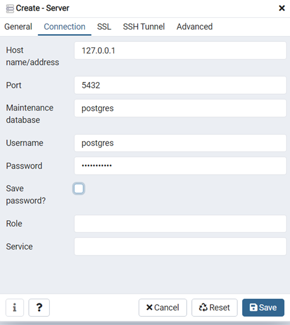

2.  **Create a new database named fhirstore**

-   (Right click on databases, “Create >”, “Database…”)

3.  **Create a new login/group role for the FHIR Appliance User, and
    make owner of the fhirstore database.**

-   Right click on the Sever (eg fhirstoredb), “Create >”, “Login/Group
    Role…”

-   Enter a user name (eg iamonfhir) in the name field (General tab)

-   Enter a password field (Definition tab)

-   Switch all the options in the Privileges tab to Yes

-   Select the fhirstore database and change the owner to iamonfhir
    (Right click on the data, “Properties…”, General tab

> This username and password are what the FHIR Appliance will use when
> connecting to the database. For example it will need to be configured
> in the FHIR Appliance .env files as part of the database connection
> string.

4.  **Create the database tables needed by the FHIR Appliance**

-   These are created automatically by the FHIR Appliance the first time
    it runs

## Backups and High Availability

For a production server it is important to configure backups and high
availability

1.  **Configure backups**

-   Information about configuring backups can be found here:

<https://www.postgresql.org/docs/current/backup.html>

-   Postgres offers several backup options, and further guidance can be
    found online – for example:

<https://www.enterprisedb.com/blog/postgresql-database-backup-recovery-what-works-wal-pitr>

-   It is worth noting that the two schemas created for the FHIR
    Appliance have significantly different characteristics

    -   The main “public” schema contains the FHIR Resources, and will
        be critical to restore quickly to get running again in the
        event of a disaster

    -   The “audit” schema is vital to archive securely to preserve an
        audit trial. However it has potential to grow large, and it
        would not be vital to immediately restore the historical audit
        trail to restart operations after a disaster

There may therefore be benefit in separate backups of the two schemas.

2.  **Configure high availability**

-   Information about configuring high availability can be found here:

<https://www.postgresql.org/docs/current/high-availability.html>

-   Again there is further guidance available online, for example:

<https://www.enterprisedb.com/postgres-tutorials/how-implement-repmgr-postgresql-automatic-failover>

-   There are also various replication tools available (some free and
    others licensed) which may relevant.

## Enterprise Support

Whilst Postgres is free, several companies offer enterprise support
agreements if this is desired. For example, the Postgres download page
is sponsored, and other companies offer similar services. As noted
above, most cloud providers also offer a fully managed Postgres
database-as-a-service.

# IIS

In this section covers the basics of installing and configuring
Microsoft Internet Information Server on Windows Server 2019 - to
provide reverse proxy and load balancing services. We also look at
installing certificates for TLS including Mutual Authentication

***The aim is to provide enough information to help you get started and
to point out any specifics relevant to this installation. However IIS is
a complex product and configuring it in a correct and security-hardened
manner is non-trivial. You will need to supplement and adjust these notes with your
own knowledge of IIS and of your local infrastructure and policies if you are planning a production deployment.***

## Install IIS (including security options, plus ARR)

1.  **Install IIS**

-   In Server Manager, “Add roles and features”, and add the “Web Server
    (IIS)” feature

-   Under “Security”, make sure that the following options are ticked,
    as they may be needed for configuring TLS Mutual Authentication:

    -   Client Certificate Mapping Authentication

    -   IIS Client Certificate Mapping Authentication

    -   URL Authorization

2.  **Install the Application Request Routing (ARR)**

-   This enables reverse-proxy features, and can be got from:
    <https://www.iis.net/downloads/microsoft/application-request-routing>

3.  **Check it is working**

-   Browse to <http://localhost> where you should see the IIS home page

4.  **Also check you can "see" the FHIR Appliance from IIS**

-   In a browser on the IIS Server, browse directly to <http://xxxxxxx/fhir/stu3/metadata> - where "xxxxxxx" is the internal server name (or IP address) of your FHIR Appliance. You should see an Operation Outcome error message from the FHIR Appliance - but thus proving that firewalls etc do indeed allow you to "see" the FHIR Appliance from the IIS server. 
 > This Operation Outcome should be considered a "good" error message as far as these IIS connectivity tests are concerned. It is a FHIR Operation Outcome saying "no token". This indicates that you are sucessfully reaching the FHIR Appliance and your request is being processed - albeit rejected due to there being no JWT token in the (empty) request message.

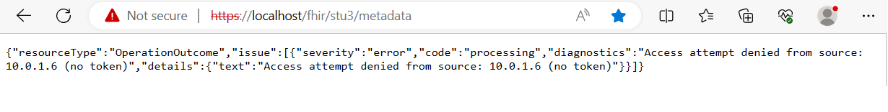

*Note: Before continuing it is also worth noting that in IIS many settings
are per “Site”. Therefore if the IIS server is shared with other
websites and applications, it is likely that you will want to configure
a new “Site” to manage the specific TLS settings and certificates
required. For the remainder of these instructions it will be assumed that the "Default Website" is being used - but please substitute as necessary*

## Configure IIS as a Reverse Proxy or Server Farm

The next step is to insert IIS into the flow as a proxy server. There are at least two ways to achieve this:

**Option 1: Simple reverse proxy**

This is the simplest configuration and just passes traffic through to a single backend with no load balancing.
 - Go to "Default Website" and select "URL Rewite" (picture of a pen and paper)
 - Choose "Add Rule" and select "Reverse Proxy Rule"
 - Fill in the routing information - basically entering the internal address of the FHIR Appliance so that requests hitting this IIS website are forwarded there
 - Check it is working - browse to <http://localhost/fhir/stu3/metadata> where you should now see the "good" error message (operation outcome) from the FHIR Appliance. 

Further details of IIS Reverse Proxy configuration can be found here:

<https://techcommunity.microsoft.com/t5/iis-support-blog/setup-iis-with-url-rewrite-as-a-reverse-proxy-for-real-world/ba-p/846222>

**Option 2: Create a Server Farm**

This is a more sophisticated option which allows for load-balancing across more than one backend - and is therefore more likely to be relevant in a real-world scenario.

-   Open IIS Manager

-   Right click on Server Farms, and select “Create Server Farms”

-   Give the farm a name

-   Add server(s) to the farm – enter the name / IP address(es) of the FHIR
    Appliance server(s)

> NB: You may wish to change the backend port. This can be done when adding the server by clicking on “Advanced Settings…” As far as the author can see there is no other way to view or edit this setting if you miss 
> this opportunity. (Although it is only a simple pointer at the server and could be easily recreated)
>
> 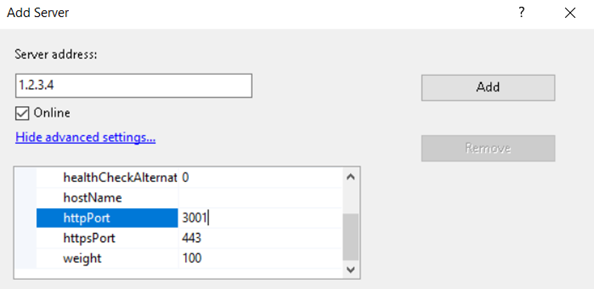

-   IIS helpfully offers to create a rewrite rule, and probably you will want to say “yes” 
> If you want to see this rule then you can again find it under the "URL Rewrite" menu option in IIS, but this time it is configured at the top-level of the IIS Server. It is a similar idea to Option 1 - but rather than fowarding traffic directly to the backend, it forwards it via the Server Farm.

 - Check it is working - browse to <http://localhost/fhir/stu3/metadata> where you should now see the "good" error message (operation outcome) from the FHIR Appliance. 

**Review additional proxy settings**

-   **SSL Offloading**

    If ticked this will forward requests to the backend (eg FHIR Appliance)
on http, which is the default and simplest option. This also allows
the possibility of configuring just an IP address for the back end
servers – ie a host name is also possible but not necessary.

    If not ticked it will use https, which does provide an extra layer of
security (if required) whilst traversing the internal network – but
will require additional SSL configuration of the FHIR Appliance
backend. It will also require a proper host name – ie with either DNS
or “hosts” routing configured. IIS does check the backend certificate
against the hostname in the configured URL, and will error on a
mismatch.

    >Note: if you do decide to use https for this backend link, then this is *your* https, and will need to be configured on the FHIR Appliance using your own internal server certificates (ie NOT using the Interweave certificates)
    > If you decide to use http (not https) for this backend link, then you may need to reconfigure your FHIR Appliance to disable its https features.

**Review additional server farm settings**

There are additional options for a Server Farm which are reasonably self-explanatory and covered by Microsoft documentation, however a few points of note are:

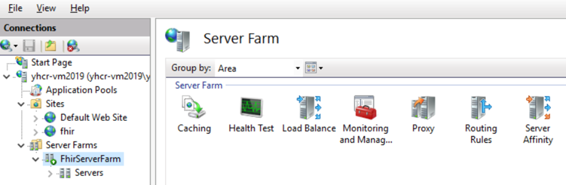

-   **Load Balance**

    Contains a choice of algorithms for distributing requests

-   **Monitoring and Management**

    Shows some useful statistics, and is also the place where you can
right-click on a server to adjust its healthy / unhealthy status

-   **Routing Rules**

    Contains the tickbox for “***SSL Offloading***” (see discussion above).

    There is also an option for “***Advanced routing***” - where this
http/https choice for the backend connection can be seen and edited
more directly, along with many other advanced settings. This includes
a “***Conditions***” option which can be used to control which type of
requests (eg by host, path, etc) come through to this server farm.
This may be useful if, for example if there are multiple sites and
applications on the IIS Server. For more details see also:

    <https://improve.dk/setting-up-multiple-iis-application-request-routing-farms-on-the-same-server/>

-   **Server Affinity**

    The FHIR Appliance is stateless – so there should be no need to
configure server affinity

-   **Healthchecks**

    Healthchecks can also be configured for a server farm, although there may be some complications. See separate section later.

## Configure SSL: https

At this point IIS is working as a proxy, but everything is still over http. So the next task is to add an SSL certificate to secure traffic over https.

1.  **Generate a pfx file**

    A pfx file is a “bundle” which combines together:

    -   The **public certificate** (crt or pem – these file types are
    interchangable)

    -   The **private key** (key)

    -   If necessary, the **root certificate** (crt or pem) which proves the
    bone-fides of the public certificate

    > Our goal is to achieve this feat with the SSL certificates provided by Onboarding. To understand how this will work, it is worth remembering the steps of the onboarding process which are (you do not necessarily need to actually do this now):
    > 1.  Use OpenSSL to generate a private key (key) and certificate signing
    request (csr)
    > 2.  The csr is uploaded, gets signed, and comes back as an SSL Server
    Certificate (pem)
    > 3.  You will also need the Root CA Certificate, which is used to verify
    the signature on the cert

-   These <u>three</u> ingredients are then combined using Open SSL to create the pfx file:

       `openssl pkcs12 -export -out ods_yhcr_sandpit_ssl.pfx -inkey ods_sandpit_provider_server.key -in ods_sandpit_provider_server.pem -certfile YHCR_SandpitPublicCA.pem -name ODS-YHCRSandpitSSLCertificate`

    > (NB: the actual filenames of the key and crt or pem files will be different – the above is illustrative. In particular "ods" will need replacing with your own ODS code)

-   Enter the original certificate passphrase when prompted (press enter if none), and provide a passphrase for the new pfx file when prompted (this is good practice, but it is also possible to just press enter for none)

3.  **Import a Certificate for SSL**
-   Open IIS Manager

-   Select the top-level node representing the entire Server, and then select “Server Certificates”. Here there are many options to work with certificates
-   Select “Import…”
-   Browse to the pfx file that you wish to import
-   Enter the passphrase (if necessary), and select the “Web Hosting” store

4.  **Edit the site Bindings**
-   Continuing in IIS Manager
-   Right click on the Site and select “Bindings”
-   Select “Add”, choose “https” from the dropdown, select the correct
    certificate from the dropdown – then press “OK”. (This assumes you
    have already followed the steps above to load the certificate into
    IIS. It will then appear in the dropdown on this screen)
-   To enforce HTTPS only - in the list of bindings, select the http
    Binding, and click “Remove”
-   Finally click “Close”

5.  **Enable SSL**
-   Now go back and select the Site, and select “SSL Settings” (the
    padlock icon)
-   Tick the box for “Require SSL”, and press “Apply”

6.  **Check it is working**
-  Browse to <https://localhost/fhir/stu3/metadata> where you should again see the "good" error message (operation outcome) from the FHIR Appliance.  Noting that we are now viewing it over https. (You may need to ignore any browser warnings about the Interweave SSL certificate not being trusted)
-  It should also be possible to attempt an end-to-end test at this point, using the Interweave Console's "healthcheck" option under the Data Provider menu.

Traffic to the website is now secured using SSL based on the relevant Interweave certificate. 

>For more details and screenshots of the IIS configurations discussed then see (for example)
<https://techexpert.tips/iis/enable-https-iis/>

## Configure TLS Mutual Authentication Part 1: Basics

The next step is to lock things down further by requiring a client certificate to be presented for TLS mutual authentication.

1.  **Import Root CA to Trusted Store**

-   Open the Windows Certificate Manager Tool (ie NOT in IIS)

-   Navigate to the Trusted Root Certification Authority folder, and
    “Import” the certificate (eg `YHCR_SandpitPublicCA.pem`, or similar)

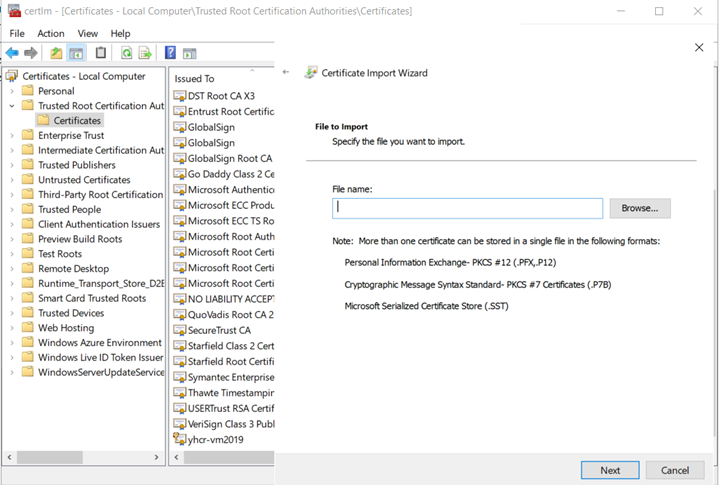

 - This step is very straightforward, but points to note include:

   -   If you have a “.pem” file then, although not listed, this will also
    work. Just change the options to “All Files” and select it
   -   Notice the long list of trusted roots in the store – by default ANY
    of these would allow access to the site! (We will lock this down further shortly)

2.  **Enforce Mutual Authentication for the site**

-   Back in IIS Manager, select the site, and then SSL Settings (the
    padlock icon)
-   On Client Certificates, choose the option for "Require"

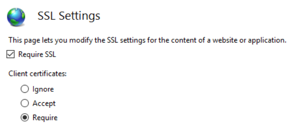

3. **Test that it works**
-  Browse to <https://localhost/fhir/stu3/metadata> 
 - Now you should no longer see the "good" error message (operation outcome) from the FHIR Appliance. Instead you will see a "bad" error message from IIS saying "forbidden" due to not presenting a client certificate. This is as expected, proving that the mutual authentiction is working

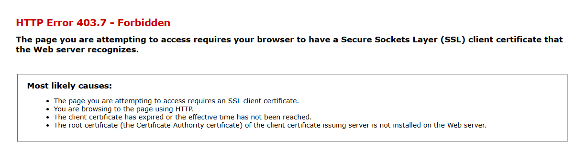

-  Run an end-to-end test using Interweave Console's "healthcheck" option under the Data Provider menu.
    - This should work fine, as this check from Interweave presents all of the correct certificates
    - Furthermore, review the warnings at the bottom of the Interweave healthcheck screen. There should no longer be an issue reported about accepting a self-signed certificate - ie we have locked things down to require a proper trusted certificate.

***Interweave Healthcheck, indicating that a self-signed certificate is accepted - therefore TLS MA not configured***
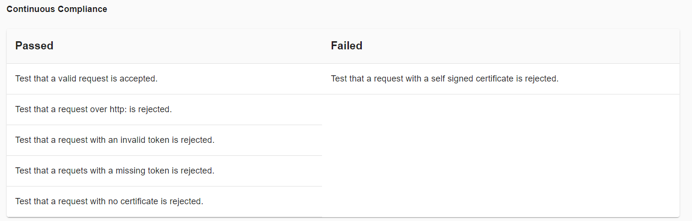

***Interweave Healthcheck, with this issue resolved once TLS MA configuration is in place***
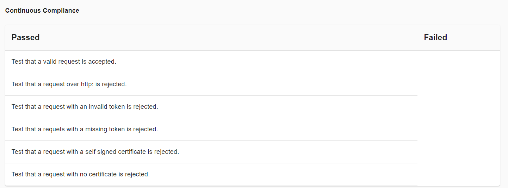
 
 ## Configure TLS Mutual Authentication Part 2: Authenticated User Mapping

The above configuration of mutual authentication is OK up to a point, but there are still some issues - due to IIS's approach to configuring mutual authentication.

>***The underlying issue is that Trusted Root CA certificates are imported to the Windows server-wide store. This means that a “simple” implementation of TLS-MA on IIS may
be easily configured to require a trusted certificate, but that this will accept a certificate from ANY of the Trusted Root CAs in the global Windows certificate store. Whilst this is still a reasonable level of protection, the site is still not, by default, locked down to enforcing credentials from <u>only</u> the Interweave CA.***

Research into this indicates that IIS's "mindset" in terms of security configuration is to **use the certificate as a mechanism for authenticating a "user"**. This then opens up the full sophistication of IIS's user-based security and authorisation configuration.

The additional steps to add this extra authentication layer are:

1.  **Create a user account**

 - This is just a normal Windows user account – for example in Computer
Management, Local Users and Groups. This is the user which we will map to the
certificate. 
 - You may want to make sure that the password does not expire. 

2.  **Map Certificate to User**

-   In IIS Manager, on the Site, select “***Configuration Editor***”
    (the icon of a piece of paper)

-   Select the setting
    “*system.webserver/security/authentication/iisClientCertificateMappingAuthentication*”,
    and make sure it is “enabled” (This assumes that the feature is
    installed – see the first step of installing IIS).

-   In the details, make sure that
    “*manyToOneCertificateMappingsEnabled*” is true, then click on the
    “…” to the right of “(Count=1)”

-   In the properties dialogue enter the username and password of the user you have created - this is the user we will log on as
 -  Drill in again to edit the "rules" field on this screen
 -  In here, specify that only certificates issued by Interweave will be accepted as authentication for this user
    - certificateField = Issuer
    - certificateSubField = CN
    - matchCriteria = ca.sandpit.yhcr.nhs.uk
     > *NB: The actual name of the CN will obviously vary slightly. If in doubt then look at the CA Root Certificate that you imported in the previous steps.*

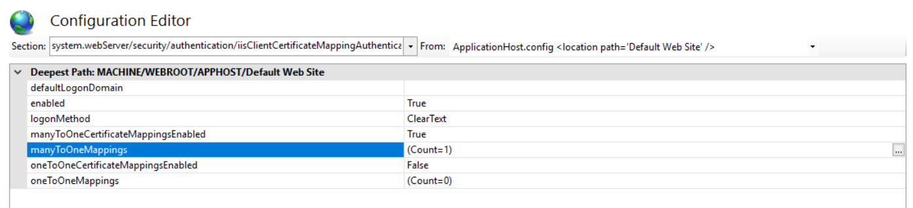

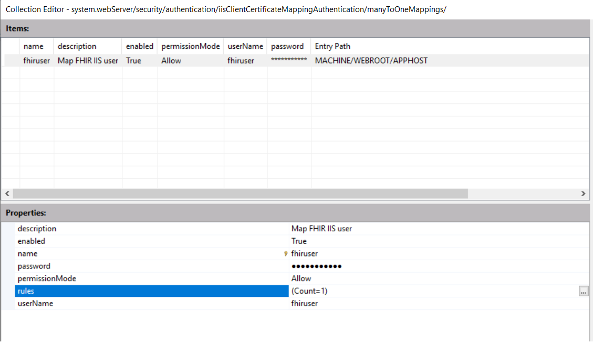

3.  **Lock down the site to authenticated users only**

 - There are a couple of different ways to do this, and belt-and-braces suggests that all might be applied:
 - In IIS Manager, on the Site, select ***Authentication***. Disable the option for "Anonymous Authentication"
 - In IIS Manager, on the Site, select ***Authorization Rules***. Remove the default rule for "All Users". Instead add a new Allow Rule for only the user created above.

 > What we have now achieved is that, in addition to needing to present (any) trusted client certificate, we will only allow access to the site for our specially created user. And the only way to authenticate as that user is to present a certificate issued by Interweave.

4.  **Test that it still works**
 - The tests are basically the same as the previous section - ie browse to <https://localhost/fhir/stu3/metadata> and check you are still locked out (as expected), and then run the Interweave Console healthchecks and check that these still work (as they present the correct Interweave client certificate)
  - It is difficult to perform a test to prove that other trusted but non-Interweave certificates are blocked, but some suggestions include:
    - To test by temporarily "sabotaging" the certificate mappings created above - for example deliberately misspelling the certificate CN - and checking that the Interweave Console healthcheck then fails to connect
    - Another test is to check that the user authentication is working by going back into the site's "SSL Settings" and temporarily downgrading "Client Certificates" from "Require" to "Accept"
      - This should actually make no difference to the results. 
      - Even though a client certificate is no longer "required" to make a connection, the user authentication means that you still can't get in unless you present the right certificate - ie one that is mapped to the authorised user
      - When done, put the "SSL Settings" back to "Required" as belt-and-braces.

 ## Configure IIS Server Farm Health Test

The final step is if you wish to configure IIS with a Server Farm which has health tests to detect unresponsive FHIR Appliance backends.

***It is assumed that the previous instructions have already been followed - ie an IIS website has been set up using a Server Farm, and SSL and trusted client certificates have been configured, and the Interweave certificate mapped to an authenticated user***

The FHIR Appliance facilities healthchecks by providing a health test on the root url - this returns a simple response-time indication:
 - To see this on the IIS Server, browse to https://localhost/
 - This simple test works even if JWT validation is enabled for other requests to the FHIR server itself, so it is useful for a simple health test 
 - NB: You may however have to temporarily disable some of the above enforcement of client certificates if you want to try this out!

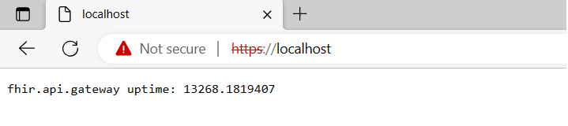

This can be used to configure a health test

-   Back in IIS Manager, click on the Web Farm, and then on the Health
    Check icon

-   Configure the URL as http://localhost/, and the Response match as `fhir.api.gateway uptime`

-   Press “Verify URL Test” to check it is working

***Note that this is a <u>single</u> URL for the “frontend” website. IIS
does not appear to offer a way to direct healthchecks at specific
“backend” servers.***

***TODO - new screenshot***

Notice that there is also an option for a “Live Traffic Test”, however
this is more problematic. The FHIR Appliance currently seems to be quite
enthusiastic in its use of HTTP 500 responses – for example a 500 is
returned if JWT verification fails. Therefore the Live Traffic Test may
be better left on the default, disabled, settings.

The following link provides useful further details of these IIS
healthcheck features:
<https://blogs.iis.net/richma/application-request-routing-health-check-features>

**Possible complications**

These healthchecks can be problematic:

 - The basic complication is that IIS Web Farms do not allow configuration of healthchecks directly to the backend servers. Rather there is a single URL to check the <u>frontend</u> website. There is also no way for this URL to present any credentials. This means that if the website is locked down with TLS Mutual Authentication, then the healthchecks may be unable to get through – and the entire site will go “unhealthy” and take itself down!

 - Having said this, it does not always seem to be a problem. If SSL Offload is enabled using standard ports, and then the healthcheck is configured for http://localhost/ and it seems to work fine.

   > Note that this healthcheck is using http (NOT https)! This is despite the fact that only https is enabled for the site, and that attempting to browse "normally" to http://localhost/ doesn't work. The author has been unable to figure out exactly why/how this works (and would welcome further explanation if you understand more fully)

 - However there are other scenarios - eg with SSL on the backend link, or with non-standard ports - where there are problems.
   - The basic workaround idea is to leave the root (only) of the website open - ie not secured with TLS-MA. Thus allowing the healthcheck response to continue. Additional configuration is instead used to apply the TLS-MA lockdown specifically to the “/fhir” subdirectory
   - In IIS Manager, select the site, SSL Settings (the padlock icon), and on Client Certificates downgrade the option from "Require" to "Accept"
     > This allows connection without a certificate, relying instead on the certificate-mapped user authentication to protect the site. IIS is now “looking” for a certificate and processing it if it finds one (eg to authenticate a user). However nothing is enforced. Thus laying the groundwork for more sophisticated user authentication settings.

   - Now we want to "open up" the root of the site (only), allowing unauthenticated access to the heath test. Whilst still protecting the  "/fhir" subdirectory.
   - There does not appear to be a way to do this from the IIS Manager user interface – it is necessary to edit the IIS configuration files manually.

      -   Edit ***applicationHost.config*** – this can be found in
    ***Windows/System32/inetsrv/config***

      -   The file is large, but you are looking for a section like this
    (probably at the bottom). It is fairly easy to see how this
    encodes the settings that we have just been making in the UI.

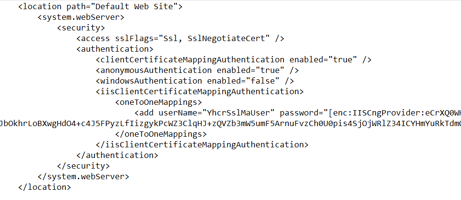

-   Leave this section alone, but make a second copy immediately
    underneath and edit it as follows (you can also find an example in
    the “misc” folder of the install)

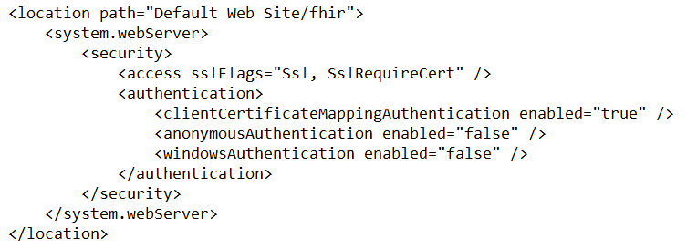

-   Important points in this configuration are:

    -   ***location path*** – states that this configuration applies to
        the “fhir” directory only

    -   ***sslFlags – SslRequreCert*** means that a valid certificate
        (albeit from ANY of the trusted CAs) must be presented to get
        in.

     > *Note: the author has had some difficulties with this setting mysteriously locking out even when a valid certificate is presented. It would be possible to “turn it down” to SslNegotiateCert and still be protected by the other authentication settings.*

-   ***authentication*** – most important is that
    anonymousAuthentication is “false” - so anonymous users are locked
    out. And clientCertificateMappingAuthentication is “true” – and so
    the only way to acquire an identity and get in here is by matching
    with the certificate configured in the previous section.

Obviously after making changes you should retest to confirm that:
1. The health tests are working as expected, and are able to access the root, with its simple response-time indication
2. Attempting to browse directly to the /fhir directory is blocked if you do not present a client certificate
3. The Interweave Console healthcheck (which presents the correct client certificate) continues to work with no errors or warnings

## IIS Further Reading

The following links have been useful in researching this section, and
may be of interest:

<https://www.lucadentella.it/en/2018/04/18/iis-mutua-autenticazione-con-certificati-ssl/>

<https://hafizmohammed.medium.com/configuring-client-certificates-on-iis-95aef4174ddb>

<https://medium.com/@yildirimabdrhm/configuring-iis-for-client-certificate-mapping-authentication-d7f707506a97>

<https://hostadvice.com/how-to/how-to-configure-iis-user-authentication/>

<https://docs.microsoft.com/en-us/iis/get-started/planning-your-iis-architecture/deep-dive-into-iis-configuration-with-iis-7-and-iis-8>

<https://learn.objectiflune.com/blog/security/control-http-access-with-iis-as-a-reverse-proxy/>

# Other Web Proxies

## NGINX

Very similar topics as for IIS will need to be considered for NGINX – ie
configuring SSL, Mutual Authentication, and Load Balancing. However this
should be a simpler – given NGINX’s more straightforward design in terms
of probing backend servers and assigning client certificates to
services.

The following links cover installing NGINX:

<https://www.digitalocean.com/community/tutorials/how-to-install-nginx-on-ubuntu-18-04>

<http://nginx.org/en/docs/windows.html>

The following links cover configuring SSL, Mutual Authentication, and
Load Balancing:

<http://nginx.org/en/docs/http/configuring_https_servers.html>

<https://docs.nginx.com/nginx/admin-guide/security-controls/terminating-ssl-http/>

<https://smallstep.com/hello-mtls/doc/server/nginx>

<https://docs.nginx.com/nginx/admin-guide/load-balancer/http-load-balancer/>

More time could be spent fleshing out further examples on request.
